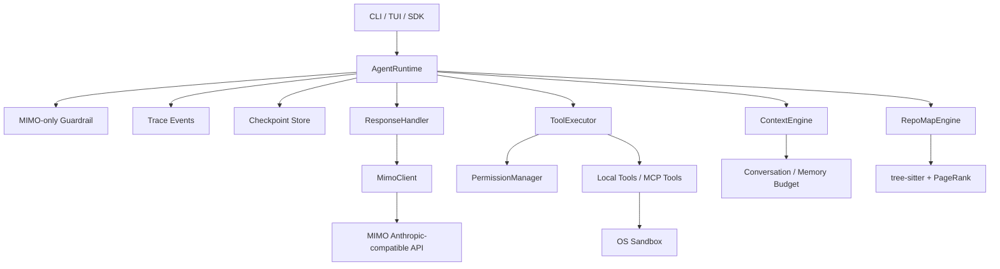

<div align="center">

[](README.md) &nbsp; [](README.zh-CN.md)

```
 ▄███▄     XiaoTie v3
 █ ⚙ █    MIMO-only Agent Runtime
 ▀███▀
```

# XiaoTie · 小铁

### A MIMO-only local coding-agent runtime — state machine · guardrails · trace · checkpoints · sandbox

<p align="center">
  
  
  
  
  
</p>

</div>

> XiaoTie v3 stopped being a multi-provider wrapper. It collapses the model boundary to a single `provider: mimo` and puts the engineering weight back on the agent runtime itself — state machine, guardrails, trace, checkpoints, tool permissions, context budget, RepoMap, sandboxed execution — not on adapter layers.

---

## Overview

XiaoTie is a **coding-agent runtime, not a model aggregator**. v3 fixes the model entry to MIMO and invests everything else into a clean, observable runtime: a phased state machine that emits structured trace events and checkpoints at every step, so persistence, resume, human-in-the-loop, and trace visualization all have a stable data boundary to build on.

---

## 1. Positioning

| Decision | v3 behavior |
|---|---|
| Model entry | `provider: mimo` only |
| Default model | `mimo-v2-pro` |
| Optional models | `mimo-v2-pro`, `mimo-v2-omni` |
| API key | `MIMO_API_KEY` or `${secret:api_key}` |
| Thinking | off by default; opt in with `--thinking` |
| Multi-provider | rejects OpenAI/Anthropic/Gemini/DeepSeek/Qwen provider params |

---

## 2. Architecture



Runtime core: [`xiaotie/agent/runtime.py`](xiaotie/agent/runtime.py); v3 architecture primitives: [`xiaotie/agent/architecture.py`](xiaotie/agent/architecture.py).

### Runtime loop

```text
input_guardrail
  -> thinking
  -> acting
  -> observing
  -> reflecting
  -> completed | failed | cancelled
```

Every key phase emits a structured `AgentTraceEvent` and writes an `AgentCheckpoint`.

---

## 3. Quick Start

```bash
git clone https://github.com/LeoLin990405/xiaotie.git
cd xiaotie
pip install -e ".[dev,tui,secrets,repomap]"
```

Configure the MIMO key (env or system keyring):

```bash
export MIMO_API_KEY="your-key"
# or
xiaotie secret set api_key
```

Minimal config:

```yaml
api_key: ${secret:api_key}
api_base: https://token-plan-sgp.xiaomimimo.com/anthropic
model: mimo-v2-pro
provider: mimo

max_steps: 50
workspace_dir: ./workspace
thinking_enabled: false

tools:
  enable_file_tools: true
  enable_bash: true
  enable_git: true
```

Run:

```bash
xiaotie                              # interactive CLI
xiaotie --tui                        # Textual TUI
xiaotie -p "analyze this repo" -f json
xiaotie -p "refactor this function" -q
```

---

## 4. Python API

```python
import asyncio

from xiaotie.agent import AgentConfig, AgentRuntime
from xiaotie.llm import LLMClient
from xiaotie.tools import BashTool, ReadTool, WriteTool


async def main():
    llm = LLMClient(provider="mimo", model="mimo-v2-pro")

    runtime = AgentRuntime(
        llm_client=llm,
        system_prompt="You are XiaoTie, a careful local coding agent.",
        tools=[ReadTool(workspace_dir="."), WriteTool(workspace_dir="."), BashTool()],
        config=AgentConfig(max_steps=30, stream=True),
    )

    result = await runtime.run("Find the refactor entry points in this project")
    print(result)
    print(runtime.trace_events[-1])


asyncio.run(main())
```

---

## 5. Core Modules

| Module | Responsibility |
|---|---|
| `xiaotie.llm` | MIMO-only facade — `LLMClient`, `MimoClient` |
| `xiaotie.agent.architecture` | phase / trace event / checkpoint / guardrail primitives |
| `xiaotie.agent.runtime` | state-machine execution loop + trace/checkpoint hooks |
| `xiaotie.agent.executor` | tool execution, permissions, audit, parallel calls |
| `xiaotie.agent.response` | streaming response, token stats, summarization |
| `xiaotie.context_engine` | context budget + message assembly |
| `xiaotie.repomap_v2` | tree-sitter AST + PageRank code map |
| `xiaotie.permissions` | risk assessment, confirmation, sensitive-output redaction |
| `xiaotie.secrets` | keyring/env/config layered secret resolution |
| `xiaotie.sandbox` | macOS Seatbelt / Linux Bubblewrap / rlimits |

---

## 6. CLI

| Command | Description |
|---|---|
| `xiaotie` | interactive CLI |
| `xiaotie --tui` | Textual TUI |
| `xiaotie -p "<q>"` | non-interactive run |
| `xiaotie -p "<q>" -f json` | JSON output |
| `xiaotie --thinking` | explicitly enable MIMO thinking |
| `xiaotie secret set api_key` | store the MIMO key |
| `xiaotie secret list` | list stored secrets |

Interactive commands: `/help` `/tools` `/map` `/find` `/tree` `/tokens` `/compact` `/secret` `/reset` `/quit`.

---

## 7. Verification

```bash
uv run --python 3.12 --extra dev ruff check xiaotie/ tests/unit/
uv run --python 3.12 --extra dev python -m pytest tests/unit -q
uv run --python 3.12 --extra dev python -m pytest tests/integration/test_core_business_smoke.py -v --tb=short -m smoke
```

Latest local result:

| Gate | Result |
|---|---|
| Unit tests | `1674 passed, 39 skipped` |
| Smoke integration | `3 passed` |
| Coverage | `62%` |

---

## 8. Migration

v3 rejects these legacy provider configs:

```yaml
provider: openai      # rejected
provider: anthropic   # rejected
provider: gemini      # rejected
provider: deepseek    # rejected
provider: qwen        # rejected
```

Use:

```yaml
provider: mimo
model: mimo-v2-pro
api_key: ${secret:api_key}
```

The old `Agent` class is kept for compatibility but deprecated — new code should use `AgentRuntime`.

---

## Roadmap

- Persistent checkpoint store
- Trace timeline visualization
- Resumable execution
- Human-in-the-loop interrupt & resume
- Unified MCP resource/prompt/tool registry
- Auto budget tuning for RepoMap × ContextEngine

---

## License

[MIT](LICENSE) © 2026 Leo Lin
