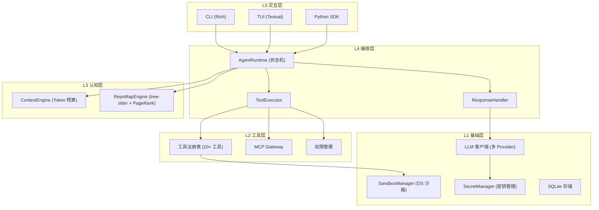

<div align="center">

```
 ▄███▄     小铁 XiaoTie v2.1
 █ ⚙ █    状态机 Agent · tree-sitter RepoMap · OS 沙箱
 ▀███▀
```

# 小铁 (XiaoTie)

**状态机驱动的 AI Coding Agent 框架，内置 OS 级沙箱、tree-sitter 代码导航和分层密钥管理。**


[English](./README_EN.md) · [变更日志](./CHANGELOG.md) · [API 参考](./docs/api-reference.md)

</div>

---

## 功能截图

### 交互式 CLI

<div align="center">

</div>

> 支持深度思考、流式输出、多工具并行执行、状态机实时展示。

### 架构总览

<div align="center">

</div>

> 5 层架构: 交互层 → 编排层 (状态机) → 认知层 → 工具层 → 基础层

### 密钥管理

<div align="center">

</div>

> 分层密钥解析: System Keyring → 环境变量 → 配置 Fallback

### CI/CD 流水线

<div align="center">

</div>

> Lint → Test (4 Python 版本) → Security Scan → Performance Gate

---

## 特性

### v2.1 亮点

| 模块 | 说明 | 状态 |
|------|------|------|
| **AgentRuntime** | 状态机驱动 (IDLE→THINKING→ACTING→OBSERVING→REFLECTING)，已替代旧 Agent 循环 | ✅ 已接入 CLI/TUI |
| **ToolExecutor** | 并行工具执行、权限检查、审计日志、敏感输出脱敏 | ✅ 完整集成 |
| **ResponseHandler** | 流式/非流式统一处理、Token 预算管理、自动摘要 | ✅ 完整集成 |
| **ContextEngine** | 基于优先级的 Token 预算上下文组装 (system/repo_map/memory/conversation) | ✅ 已接入 AgentRuntime |
| **RepoMapEngine** | tree-sitter AST 解析 + NetworkX PageRank 代码导航 (支持 8 种语言) | ✅ 已接入 AgentRuntime |
| **SandboxManager** | OS 级沙箱 (macOS Seatbelt / Linux Bubblewrap / Fallback rlimits) | ✅ 完整集成 |
| **SecretManager** | 分层密钥管理 (keyring → 环境变量 → 配置 fallback)，`${secret:...}` 语法 | ✅ 已接入配置加载 |

### v2.1 集成进展 (相比 v2.0)

- ✅ **AgentRuntime 接入 CLI/TUI 主流程** — 替代旧 Agent 类，旧 API 标记 deprecated
- ✅ **ContextEngine + RepoMap 接入 AgentRuntime** — LLM 调用前自动组装 token 预算上下文
- ✅ **SecretManager 接入配置加载** — Config.load() 自动解析 `${secret:...}` / `${env:...}` 占位符
- ✅ **`/secret` 命令注册** — 交互模式中直接管理密钥
- ✅ **核心模块覆盖率 ≥ 90%** — runtime 97%, executor 90%, secrets 91%, context_engine 90%

### 核心能力

- Agent 执行循环 (状态机 + 传统模式兼容)
- 流式输出、深度思考 (thinking mode)
- 会话管理、Token 自动摘要
- 并行工具执行、优雅取消 (Ctrl+C)
- TUI 模式 (Textual) 含首次运行引导向导、非交互模式 (JSON 输出)
- MCP 协议支持 (连接外部 MCP 服务器)
- 插件系统、自定义命令
- 多 LLM 支持 (Anthropic / OpenAI / GLM / Gemini / DeepSeek / Qwen / MiniMax)
- 多 Agent 协调 (Coordinator / Expert / Executor / Supervisor 角色)
- 记忆系统 (短期/长期/情景/语义/工作记忆)
- 语义搜索 (chromadb 向量存储)

### 工具系统

20+ 内置工具:

| 类别 | 工具 |
|------|------|
| **文件与代码** | read_file, write_file, edit_file, code_analysis, python |
| **系统操作** | bash, git, system_info, process_manager |
| **Web & 网络** | web_search, web_fetch, network, proxy_server |
| **高级功能** | scraper, semantic_search, telegram, macos_automation |

---

## 快速开始

### 安装

```bash
git clone https://github.com/LeoLin990405/xiaotie.git
cd xiaotie

# 基础安装
pip install -e .

# 安装所有功能
pip install -e ".[all]"

# 或按需安装
pip install -e ".[tui]"        # TUI 界面 (含首次运行向导)
pip install -e ".[repomap]"    # tree-sitter 代码导航
pip install -e ".[secrets]"    # keyring 密钥管理
pip install -e ".[search]"     # 语义搜索
```

### 配置 API Key

**推荐方式: 使用 keyring (安全)**

```bash
# 存储密钥到系统 keyring
xiaotie secret set api_key
# 输入你的 API Key

# 在 config.yaml 中引用
# api_key: ${secret:api_key}
```

**快速方式: 环境变量**

```bash
export XIAOTIE_API_KEY="your-key"
# 或
export ZHIPU_API_KEY="your-key"
```

**TUI 首次运行向导 (最简单)**

```bash
pip install -e ".[tui]"
xiaotie --tui
# 引导向导会自动收集 API Key、模型、Provider 并生成配置
```

### 运行

```bash
# 交互式
xiaotie

# TUI 模式
xiaotie --tui

# 非交互模式
xiaotie -p "帮我分析这段代码" -f json

# 安静模式
xiaotie -p "帮我重构这个函数" -q
```

---

## 架构

### 5 层架构



### AgentRuntime 状态机

```
IDLE ──→ THINKING ──→ ACTING ──→ OBSERVING ──→ REFLECTING ──→ THINKING
  ↑         │                                        │            (循环)
  │         └── 无工具调用 ──→ IDLE (完成)             └── 取消 ──→ IDLE
  └──────────────────────────────────────────────────────────────────┘
```

---

## CLI 命令

### 启动模式

| 命令 | 说明 |
|------|------|
| `xiaotie` | 交互式 CLI |
| `xiaotie --tui` | TUI 模式 (含引导向导) |
| `xiaotie -p "问题"` | 非交互模式 |
| `xiaotie -p "问题" -f json` | JSON 输出 |
| `xiaotie -p "问题" -q` | 安静模式 |

### 交互命令

| 命令 | 别名 | 说明 |
|------|------|------|
| `/help` | `/h` | 显示帮助 |
| `/quit` | `/q` | 退出 |
| `/reset` | `/r` | 重置对话 |
| `/tools` | `/t` | 显示工具 |
| `/save` | `/s` | 保存会话 |
| `/load <id>` | `/l` | 加载会话 |
| `/tokens` | `/tok` | Token 统计 |
| `/compact` | | 压缩历史 |
| `/map [tokens]` | | 代码库概览 (tree-sitter) |
| `/find <关键词>` | | 搜索文件 |
| `/tree [深度]` | | 目录结构 |
| `/stream` | | 切换流式输出 |
| `/think` | | 切换深度思考 |
| `/parallel` | | 切换并行执行 |
| `/secret` | `/sec` | 密钥管理 (set/get/list/delete/migrate) |

### 密钥管理 CLI

| 命令 | 说明 |
|------|------|
| `xiaotie secret set <key>` | 存储密钥到 keyring |
| `xiaotie secret get <key>` | 获取密钥 (掩码显示) |
| `xiaotie secret list` | 列出所有密钥 |
| `xiaotie secret delete <key>` | 删除密钥 |
| `xiaotie secret migrate` | 迁移配置文件明文密钥到 keyring |

---

## 配置

### config/config.yaml

```yaml
# API 配置 (推荐使用 ${secret:...} 而非明文)
api_key: ${secret:api_key}
api_base: https://open.bigmodel.cn/api/coding/paas/v4
model: GLM-4.7
provider: openai  # 使用 OpenAI 兼容协议

# Agent 配置
max_steps: 50
workspace_dir: ./workspace

# 重试
retry:
  enabled: true
  max_retries: 3
  initial_delay: 1.0

# 工具
tools:
  enable_file_tools: true
  enable_bash: true

# MCP 配置
mcp:
  enabled: false
  servers:
    filesystem:
      command: npx
      args: ["-y", "@modelcontextprotocol/server-filesystem", "/tmp"]
      enabled: true
```

### 密钥解析优先级

| 优先级 | 来源 | 安全性 | 说明 |
|--------|------|--------|------|
| 1 | System Keyring | 最高 | macOS Keychain / Linux Secret Service |
| 2 | 环境变量 | 中 | `XIAOTIE_<KEY>` 或 `<KEY>` |
| 3 | 配置文件 | 低 | 仅作 fallback，不推荐 |

配置文件占位符语法:

```yaml
api_key: ${secret:api_key}         # 从 keyring/环境变量解析
github_token: ${env:GITHUB_TOKEN}  # 仅从环境变量解析
```

---

## 安全模型

### OS 级沙箱

| 平台 | 后端 | 隔离级别 |
|------|------|---------|
| macOS | Seatbelt (sandbox-exec) | 内核级 (deny network/write) |
| Linux | Bubblewrap (bwrap) | 命名空间 + 文件系统隔离 |
| 通用 | Fallback (rlimits) | 资源限制 (内存 512MB, CPU 300s) |

### Capability 模型

| Capability | 说明 | 示例工具 |
|-----------|------|---------|
| `READ_FS` | 读取工作区文件 | read_file, code_analysis |
| `WRITE_FS` | 写入工作区文件 | write_file, edit_file |
| `NETWORK` | 网络访问 | web_search, web_fetch |
| `SUBPROCESS` | 子进程 | bash, python |
| `DANGEROUS` | 系统级操作 | 需要明确批准 |

### 权限系统

- 工具调用前进行风险评估 (low/medium/high)
- 低风险自动批准，高风险需要交互确认
- 敏感输出自动脱敏 (AWS Key, GitHub Token, 私钥等)
- 所有工具调用记录审计日志

---

## 支持的 LLM

| Provider | API Base | 推荐模型 |
|----------|----------|---------|
| Anthropic | https://api.anthropic.com | Claude Sonnet 4 |
| OpenAI | https://api.openai.com/v1 | GPT-4o |
| 智谱 GLM | https://open.bigmodel.cn/api/coding/paas/v4 | GLM-4.7 (深度思考) |
| Google Gemini | https://generativelanguage.googleapis.com | Gemini 2.5 Pro |
| DeepSeek | https://api.deepseek.com | DeepSeek Chat/Coder |
| Qwen | https://dashscope.aliyuncs.com | 通义千问 |
| MiniMax | https://api.minimax.io | abab 系列 |
| Ollama | http://localhost:11434 | 本地模型 |
| 自定义 | 任意 URL | 任何 OpenAI 兼容 API |

---

## 代码调用

### AgentRuntime (推荐)

```python
import asyncio
from xiaotie.agent import AgentRuntime, AgentConfig
from xiaotie.llm import LLMClient
from xiaotie.tools import ReadTool, WriteTool, BashTool

async def main():
    llm = LLMClient(
        api_key="your-key",
        api_base="https://api.anthropic.com",
        model="claude-sonnet-4-20250514",
        provider="anthropic",
    )
    config = AgentConfig(max_steps=30, parallel_tools=True)
    tools = [ReadTool(workspace_dir="."), WriteTool(workspace_dir="."), BashTool()]

    runtime = AgentRuntime(llm, system_prompt="你是小铁", tools=tools, config=config)

    # 可选: 集成 ContextEngine 和 RepoMap
    from xiaotie.context_engine import ContextEngine
    from xiaotie.repomap_v2 import RepoMapEngine
    runtime.set_context_engine(ContextEngine(token_budget=100_000))
    runtime.set_repomap_engine(RepoMapEngine(workspace_dir="."))

    result = await runtime.run("帮我创建一个 hello.py")
    print(result)
    print(runtime.get_stats())

asyncio.run(main())
```

### Agent (v1 兼容, 已标记 deprecated)

```python
from xiaotie.agent import Agent  # ⚠️ 将在 v3.0 移除
from xiaotie.llm import LLMClient
from xiaotie.tools import ReadTool, WriteTool, BashTool

agent = Agent(
    llm_client=LLMClient(...),
    system_prompt="你是小铁",
    tools=[ReadTool(), WriteTool(), BashTool()],
    stream=True,
    parallel_tools=True,
)
result = await agent.run("你好")
```

---

## 项目统计

| 指标 | 数值 |
|------|------|
| 源代码文件 | 140 个 Python 文件 |
| 代码行数 | ~48,000 行 |
| 测试用例 | 1,703 通过 / 15 跳过 |
| 测试覆盖率 | 61% (核心模块 ≥ 90%) |
| 内置工具 | 20+ |
| LLM Provider | 8+ |
| 支持语言 (RepoMap) | Python, JS, TS, Go, Rust, Java, C, C++ |

---

## 开发

### 环境搭建

```bash
git clone https://github.com/LeoLin990405/xiaotie.git
cd xiaotie
pip install -e ".[dev,all]"

# 安装 pre-commit hooks
pre-commit install
```

### 常用命令

```bash
make test            # 运行测试
make lint            # 代码检查
make format          # 格式化
make security-scan   # 安全扫描
make benchmark       # 性能基准
make ci-local        # 本地完整 CI
```

### CI/CD

GitHub Actions 工作流:

| 作业 | 触发条件 | 说明 |
|------|---------|------|
| **Lint** | push/PR | ruff lint + format check |
| **Test** | push/PR | pytest × Python 3.9-3.12, 覆盖率 ≥60% |
| **Security** | push/PR | bandit SAST + pip-audit |
| **Performance** | push/PR | 基准测试回归检查 |
| **Release** | tag v* | 构建 wheel/sdist, 发布 PyPI |

---

## 贡献指南

欢迎贡献! 请遵循以下步骤:

1. Fork 本仓库
2. 创建特性分支: `git checkout -b feature/amazing-feature`
3. 安装开发依赖: `pip install -e ".[dev,all]"`
4. 编写代码并添加测试
5. 运行本地 CI: `make ci-local`
6. 提交更改: `git commit -m "feat: add amazing feature"`
7. 推送分支: `git push origin feature/amazing-feature`
8. 创建 Pull Request

### 代码规范

- 使用 `ruff` 进行代码检查和格式化
- 新功能必须附带单元测试
- 保持 API 向后兼容
- 安全敏感代码必须通过 bandit 扫描

---

## 路线图

### v2.2 计划

- [ ] Memory 系统接入 Agent 循环 (记忆自动存取)
- [ ] 语义搜索自动集成为内置工具
- [ ] 跨会话对话持久化
- [ ] Web UI 前端
- [ ] 更多 MCP 服务器预置

### 未来方向

- 多 Agent 协作自动编排
- RAG 管线内置
- 视觉模型原生支持 (截图理解)
- VS Code / JetBrains 插件

---

## 致谢

- [MiniMax-AI/Mini-Agent](https://github.com/MiniMax-AI/Mini-Agent) - 核心架构灵感
- [Aider](https://github.com/Aider-AI/aider) - RepoMap、命令系统设计
- [Claude Code](https://docs.anthropic.com/en/docs/claude-code) - 状态机 Agent、OS 沙箱、ContextEngine
- [Open Interpreter](https://github.com/openinterpreter/open-interpreter) - 流式处理模式
- [MCP Python SDK](https://github.com/modelcontextprotocol/python-sdk) - MCP 协议集成

## License

[MIT](LICENSE)
