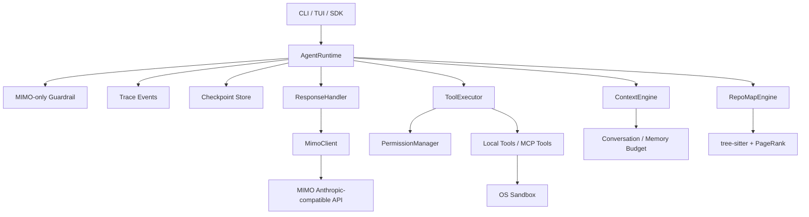

<div align="center">

[](README.md) &nbsp; [](README.zh-CN.md)

```
 ▄███▄     XiaoTie v3
 █ ⚙ █    MIMO-only Agent Runtime
 ▀███▀
```

# 小铁 · XiaoTie

### 只面向 MIMO 的本地 coding-agent runtime —— 状态机 · guardrail · trace · checkpoint · 沙箱

<p align="center">
  
  
  
  
  
</p>

</div>

> 小铁 v3 不再做多 provider 适配层。它把模型边界收束到 `provider: mimo`,把工程重点放回 Agent 运行时本身 —— 状态机、guardrail、trace、checkpoint、工具权限、上下文预算、RepoMap 和沙箱执行 —— 而不是适配层。

---

## 概览

小铁是一个 **coding-agent runtime,而不是模型聚合器**。v3 把模型入口固定到 MIMO,其余全部投入到一个干净、可观测的运行时:分阶段状态机在每一步生成结构化 trace event 与 checkpoint,让后续接持久化、resume、human-in-the-loop 和可视化 trace 时都有稳定的数据边界。

---

## 1. 当前定位

| 决策 | v3 行为 |
|---|---|
| 模型入口 | 只支持 `provider: mimo` |
| 默认模型 | `mimo-v2-pro` |
| 可选模型 | `mimo-v2-pro`, `mimo-v2-omni` |
| API Key | `MIMO_API_KEY` 或 `${secret:api_key}` |
| Thinking | 默认关闭,显式 `--thinking` 才开启 |
| 多 provider | 拒绝 OpenAI/Anthropic/Gemini/DeepSeek/Qwen 等 provider 参数 |

---

## 2. 架构



运行时核心:[`xiaotie/agent/runtime.py`](xiaotie/agent/runtime.py);v3 架构原语:[`xiaotie/agent/architecture.py`](xiaotie/agent/architecture.py)。

### Runtime Loop

```text
input_guardrail
  -> thinking
  -> acting
  -> observing
  -> reflecting
  -> completed | failed | cancelled
```

每个关键阶段都会生成结构化 `AgentTraceEvent` 并写入 `AgentCheckpoint`。

---

## 3. 快速开始

```bash
git clone https://github.com/LeoLin990405/xiaotie.git
cd xiaotie
pip install -e ".[dev,tui,secrets,repomap]"
```

配置 MIMO key(环境变量或系统 keyring):

```bash
export MIMO_API_KEY="your-key"
# 或
xiaotie secret set api_key
```

最小配置:

```yaml
api_key: ${secret:api_key}
api_base: https://token-plan-sgp.xiaomimimo.com/anthropic
model: mimo-v2-pro
provider: mimo

max_steps: 50
workspace_dir: ./workspace
thinking_enabled: false

tools:
  enable_file_tools: true
  enable_bash: true
  enable_git: true
```

运行:

```bash
xiaotie                              # 交互式 CLI
xiaotie --tui                        # Textual TUI
xiaotie -p "分析这个 repo 的结构" -f json
xiaotie -p "重构这个函数" -q
```

---

## 4. Python API

```python
import asyncio

from xiaotie.agent import AgentConfig, AgentRuntime
from xiaotie.llm import LLMClient
from xiaotie.tools import BashTool, ReadTool, WriteTool


async def main():
    llm = LLMClient(provider="mimo", model="mimo-v2-pro")

    runtime = AgentRuntime(
        llm_client=llm,
        system_prompt="你是小铁,一个谨慎的本地 coding agent。",
        tools=[ReadTool(workspace_dir="."), WriteTool(workspace_dir="."), BashTool()],
        config=AgentConfig(max_steps=30, stream=True),
    )

    result = await runtime.run("帮我整理这个项目的重构入口")
    print(result)
    print(runtime.trace_events[-1])


asyncio.run(main())
```

---

## 5. 核心模块

| 模块 | 责任 |
|---|---|
| `xiaotie.llm` | MIMO-only facade —— `LLMClient`, `MimoClient` |
| `xiaotie.agent.architecture` | phase / trace event / checkpoint / guardrail 原语 |
| `xiaotie.agent.runtime` | 状态机执行循环 + trace/checkpoint 接入 |
| `xiaotie.agent.executor` | 工具执行、权限、审计、并行调用 |
| `xiaotie.agent.response` | 流式响应、token 统计、摘要 |
| `xiaotie.context_engine` | 上下文预算 + 消息组装 |
| `xiaotie.repomap_v2` | tree-sitter AST + PageRank 代码地图 |
| `xiaotie.permissions` | 风险评估、确认、敏感输出脱敏 |
| `xiaotie.secrets` | keyring/env/config 分层密钥解析 |
| `xiaotie.sandbox` | macOS Seatbelt / Linux Bubblewrap / rlimits |

---

## 6. CLI

| 命令 | 说明 |
|---|---|
| `xiaotie` | 交互式 CLI |
| `xiaotie --tui` | Textual TUI |
| `xiaotie -p "问题"` | 非交互执行 |
| `xiaotie -p "问题" -f json` | JSON 输出 |
| `xiaotie --thinking` | 显式启用 MIMO thinking |
| `xiaotie secret set api_key` | 写入 MIMO key |
| `xiaotie secret list` | 查看已存密钥 |

交互命令:`/help` `/tools` `/map` `/find` `/tree` `/tokens` `/compact` `/secret` `/reset` `/quit`。

---

## 7. 验证

```bash
uv run --python 3.12 --extra dev ruff check xiaotie/ tests/unit/
uv run --python 3.12 --extra dev python -m pytest tests/unit -q
uv run --python 3.12 --extra dev python -m pytest tests/integration/test_core_business_smoke.py -v --tb=short -m smoke
```

最近一次本地结果:

| Gate | Result |
|---|---|
| Unit tests | `1674 passed, 39 skipped` |
| Smoke integration | `3 passed` |
| Coverage | `62%` |

---

## 8. 迁移说明

v3 会拒绝这些旧 provider 配置:

```yaml
provider: openai      # 拒绝
provider: anthropic   # 拒绝
provider: gemini      # 拒绝
provider: deepseek    # 拒绝
provider: qwen        # 拒绝
```

请统一改为:

```yaml
provider: mimo
model: mimo-v2-pro
api_key: ${secret:api_key}
```

旧 `Agent` 类仍保留兼容但已 deprecated —— 新代码请使用 `AgentRuntime`。

---

## 路线图

- 持久化 checkpoint store
- 可视化 trace timeline
- resumable execution
- human-in-the-loop 中断与恢复
- MCP resource/prompt/tool 统一注册表
- RepoMap 与 ContextEngine 自动预算调优

---

## 许可

[MIT](LICENSE) © 2026 Leo Lin
