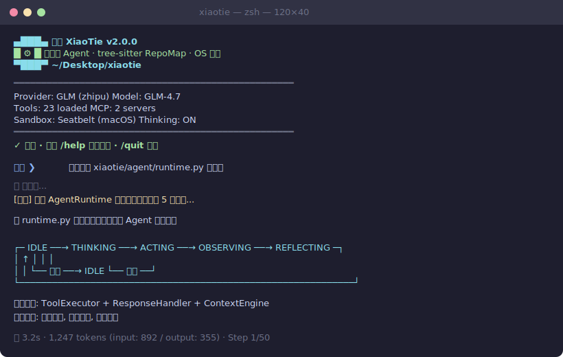
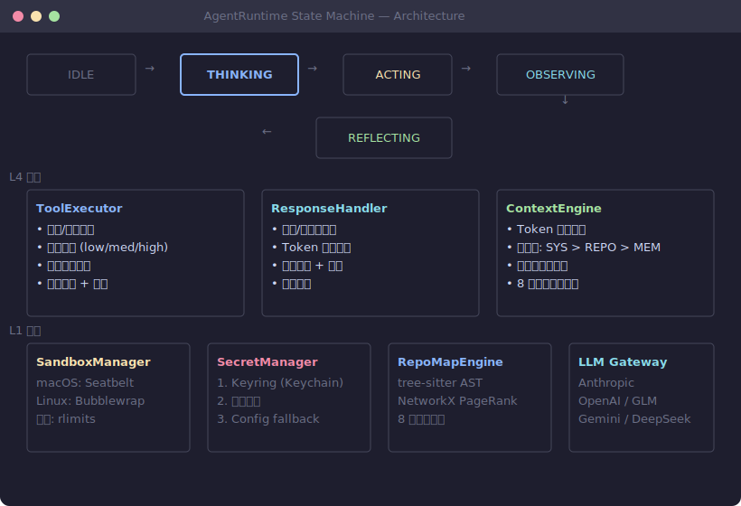
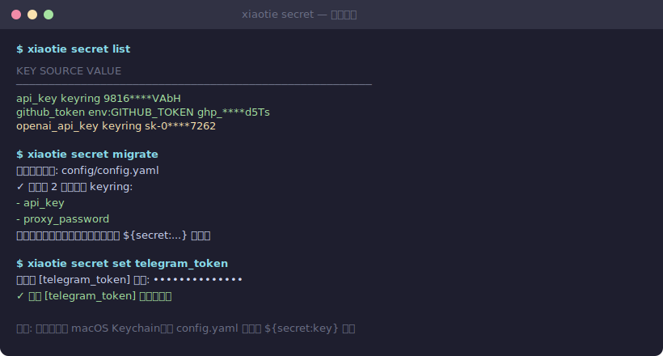
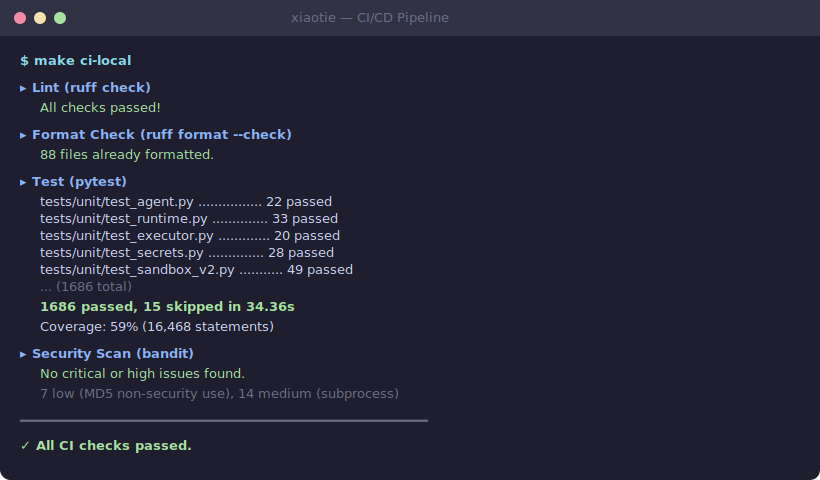
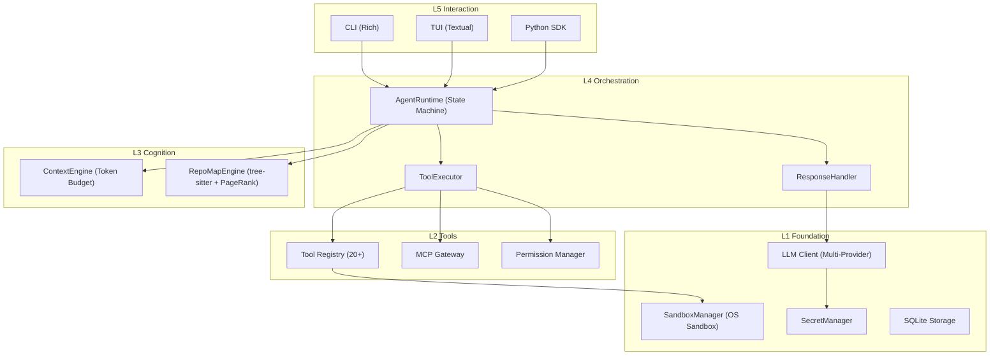

<div align="center">

```
 ▄███▄     XiaoTie v2.1
 █ ⚙ █    State Machine Agent · tree-sitter RepoMap · OS Sandbox
 ▀███▀
```

# XiaoTie (小铁)

**A state-machine-driven AI coding agent framework with built-in OS-level sandboxing, tree-sitter code navigation, and layered secret management.**


[中文](./README.md) · [Changelog](./CHANGELOG.md) · [API Reference](./docs/api-reference.md)

</div>

---

## Screenshots

### Interactive CLI

<div align="center">

</div>

> Deep thinking, streaming output, parallel tool execution, real-time state display.

### Architecture Overview

<div align="center">

</div>

> 5-layer architecture: Interaction → Orchestration (state machine) → Cognition → Tools → Foundation

### Secret Management

<div align="center">

</div>

> Layered resolution: System Keyring → Environment Variables → Config Fallback

### CI/CD Pipeline

<div align="center">

</div>

> Lint → Test (4 Python versions) → Security Scan → Performance Gate

---

## Features

### v2.1 Highlights

| Module | Description | Status |
|--------|-------------|--------|
| **AgentRuntime** | State machine driven (IDLE→THINKING→ACTING→OBSERVING→REFLECTING), replaces legacy Agent | ✅ Wired into CLI/TUI |
| **ToolExecutor** | Parallel tool execution, permission checks, audit logging, sensitive output redaction | ✅ Fully integrated |
| **ResponseHandler** | Unified streaming/non-streaming, token budget management, auto-summarization | ✅ Fully integrated |
| **ContextEngine** | Priority-based token-budgeted context assembly (system/repo_map/memory/conversation) | ✅ Wired into AgentRuntime |
| **RepoMapEngine** | tree-sitter AST + NetworkX PageRank code navigation (8 languages) | ✅ Wired into AgentRuntime |
| **SandboxManager** | OS-level sandboxing (macOS Seatbelt / Linux Bubblewrap / Fallback rlimits) | ✅ Fully integrated |
| **SecretManager** | Layered secret management (keyring → env vars → config), `${secret:...}` syntax | ✅ Wired into config loading |

### v2.1 Integration Progress (vs v2.0)

- ✅ **AgentRuntime wired into CLI/TUI** — Replaces old Agent class, legacy API marked deprecated
- ✅ **ContextEngine + RepoMap wired into AgentRuntime** — Auto-assembles token-budgeted context before LLM calls
- ✅ **SecretManager wired into config loading** — Config.load() auto-resolves `${secret:...}` / `${env:...}` placeholders
- ✅ **`/secret` command registered** — Manage secrets directly in interactive mode
- ✅ **Core module coverage ≥ 90%** — runtime 97%, executor 90%, secrets 91%, context_engine 90%

### Core Capabilities

- Agent execution loop (state machine + legacy mode compatible)
- Streaming output, deep thinking (thinking mode)
- Session management, automatic token summarization
- Parallel tool execution, graceful cancellation (Ctrl+C)
- TUI mode (Textual) with first-run onboarding wizard, non-interactive mode (JSON output)
- MCP protocol support (connect to external MCP servers)
- Plugin system, custom commands
- Multi-LLM support (Anthropic / OpenAI / GLM / Gemini / DeepSeek / Qwen / MiniMax)
- Multi-agent coordination (Coordinator / Expert / Executor / Supervisor roles)
- Memory system (short-term / long-term / episodic / semantic / working memory)
- Semantic search (chromadb vector store)

### Tool System

20+ built-in tools:

| Category | Tools |
|----------|-------|
| **File & Code** | read_file, write_file, edit_file, code_analysis, python |
| **System** | bash, git, system_info, process_manager |
| **Web & Network** | web_search, web_fetch, network, proxy_server |
| **Advanced** | scraper, semantic_search, telegram, macos_automation |

---

## Quick Start

### Installation

```bash
git clone https://github.com/LeoLin990405/xiaotie.git
cd xiaotie

# Basic install
pip install -e .

# Install all features
pip install -e ".[all]"

# Or install selectively
pip install -e ".[tui]"        # TUI interface (with onboarding wizard)
pip install -e ".[repomap]"    # tree-sitter code navigation
pip install -e ".[secrets]"    # keyring secret management
pip install -e ".[search]"     # semantic search
```

### Configure API Key

**Recommended: keyring (secure)**

```bash
# Store secret in system keyring
xiaotie secret set api_key
# Enter your API key when prompted

# Reference in config.yaml
# api_key: ${secret:api_key}
```

**Quick: environment variable**

```bash
export XIAOTIE_API_KEY="your-key"
```

**TUI onboarding wizard (easiest)**

```bash
pip install -e ".[tui]"
xiaotie --tui
# The wizard will collect your API key, model, provider and generate config
```

### Run

```bash
# Interactive
xiaotie

# TUI mode
xiaotie --tui

# Non-interactive
xiaotie -p "Analyze this code" -f json

# Quiet mode
xiaotie -p "Refactor this function" -q
```

---

## Architecture

### 5-Layer Architecture



### AgentRuntime State Machine

```
IDLE ──→ THINKING ──→ ACTING ──→ OBSERVING ──→ REFLECTING ──→ THINKING
  ↑         │                                        │            (loop)
  │         └── no tool calls ──→ IDLE (done)        └── cancel ──→ IDLE
  └──────────────────────────────────────────────────────────────────┘
```

---

## Security Model

### OS-Level Sandbox

| Platform | Backend | Isolation Level |
|----------|---------|-----------------|
| macOS | Seatbelt (sandbox-exec) | Kernel-level (deny network/write) |
| Linux | Bubblewrap (bwrap) | Namespace + filesystem isolation |
| Generic | Fallback (rlimits) | Resource limits (512MB mem, 300s CPU) |

### Capability Model

| Capability | Description | Example Tools |
|-----------|-------------|---------------|
| `READ_FS` | Read workspace files | read_file, code_analysis |
| `WRITE_FS` | Write workspace files | write_file, edit_file |
| `NETWORK` | Network access | web_search, web_fetch |
| `SUBPROCESS` | Subprocesses | bash, python |
| `DANGEROUS` | System-level ops | Requires explicit approval |

---

## Supported LLMs

| Provider | API Base | Recommended Model |
|----------|----------|-------------------|
| Anthropic | https://api.anthropic.com | Claude Sonnet 4 |
| OpenAI | https://api.openai.com/v1 | GPT-4o |
| GLM (Zhipu) | https://open.bigmodel.cn/api/coding/paas/v4 | GLM-4.7 (deep thinking) |
| Google Gemini | https://generativelanguage.googleapis.com | Gemini 2.5 Pro |
| DeepSeek | https://api.deepseek.com | DeepSeek Chat/Coder |
| Qwen | https://dashscope.aliyuncs.com | Qwen |
| MiniMax | https://api.minimax.io | abab series |
| Ollama | http://localhost:11434 | Local models |
| Custom | Any URL | Any OpenAI-compatible API |

---

## Code Usage

### AgentRuntime (Recommended)

```python
import asyncio
from xiaotie.agent import AgentRuntime, AgentConfig
from xiaotie.llm import LLMClient
from xiaotie.tools import ReadTool, WriteTool, BashTool

async def main():
    llm = LLMClient(
        api_key="your-key",
        api_base="https://api.anthropic.com",
        model="claude-sonnet-4-20250514",
        provider="anthropic",
    )
    config = AgentConfig(max_steps=30, parallel_tools=True)
    tools = [ReadTool(workspace_dir="."), WriteTool(workspace_dir="."), BashTool()]

    runtime = AgentRuntime(llm, system_prompt="You are XiaoTie", tools=tools, config=config)

    # Optional: integrate ContextEngine and RepoMap
    from xiaotie.context_engine import ContextEngine
    from xiaotie.repomap_v2 import RepoMapEngine
    runtime.set_context_engine(ContextEngine(token_budget=100_000))
    runtime.set_repomap_engine(RepoMapEngine(workspace_dir="."))

    result = await runtime.run("Create a hello.py file")
    print(result)

asyncio.run(main())
```

### Agent (v1 Compatible, deprecated)

```python
from xiaotie.agent import Agent  # ⚠️ Will be removed in v3.0
from xiaotie.llm import LLMClient
from xiaotie.tools import ReadTool, WriteTool, BashTool

agent = Agent(
    llm_client=LLMClient(...),
    system_prompt="You are XiaoTie",
    tools=[ReadTool(), WriteTool(), BashTool()],
    stream=True,
    parallel_tools=True,
)
result = await agent.run("Hello")
```

---

## Project Stats

| Metric | Value |
|--------|-------|
| Source files | 140 Python files |
| Lines of code | ~48,000 |
| Test cases | 1,703 passed / 15 skipped |
| Test coverage | 61% (core modules ≥ 90%) |
| Built-in tools | 20+ |
| LLM providers | 8+ |
| Languages (RepoMap) | Python, JS, TS, Go, Rust, Java, C, C++ |

---

## Development

### Setup

```bash
git clone https://github.com/LeoLin990405/xiaotie.git
cd xiaotie
pip install -e ".[dev,all]"

# Install pre-commit hooks
pre-commit install
```

### Common Commands

```bash
make test            # Run tests
make lint            # Lint check
make format          # Format code
make security-scan   # Security scan
make benchmark       # Performance benchmark
make ci-local        # Full local CI pipeline
```

### CI/CD

| Job | Trigger | Description |
|-----|---------|-------------|
| **Lint** | push/PR | ruff lint + format check |
| **Test** | push/PR | pytest × Python 3.9-3.12, coverage ≥60% |
| **Security** | push/PR | bandit SAST + pip-audit |
| **Performance** | push/PR | Benchmark regression check |
| **Release** | tag v* | Build wheel/sdist, publish to PyPI |

---

## Contributing

Contributions welcome! Please follow these steps:

1. Fork the repository
2. Create a feature branch: `git checkout -b feature/amazing-feature`
3. Install dev dependencies: `pip install -e ".[dev,all]"`
4. Write code and add tests
5. Run local CI: `make ci-local`
6. Commit changes: `git commit -m "feat: add amazing feature"`
7. Push branch: `git push origin feature/amazing-feature`
8. Create a Pull Request

### Code Standards

- Use `ruff` for linting and formatting
- New features must include unit tests
- Maintain backward API compatibility
- Security-sensitive code must pass bandit scan

---

## Roadmap

### v2.2 Planned

- [ ] Memory system integration into agent loop (auto store/retrieve)
- [ ] Semantic search auto-wired as built-in tool
- [ ] Cross-session conversation persistence
- [ ] Web UI frontend
- [ ] More pre-configured MCP servers

### Future Directions

- Multi-agent automatic orchestration
- Built-in RAG pipeline
- Native vision model support (screenshot understanding)
- VS Code / JetBrains plugins

---

## Acknowledgements

- [MiniMax-AI/Mini-Agent](https://github.com/MiniMax-AI/Mini-Agent) - Core architecture inspiration
- [Aider](https://github.com/Aider-AI/aider) - RepoMap, command system design
- [Claude Code](https://docs.anthropic.com/en/docs/claude-code) - State machine agent, OS sandbox, ContextEngine
- [Open Interpreter](https://github.com/openinterpreter/open-interpreter) - Streaming patterns
- [MCP Python SDK](https://github.com/modelcontextprotocol/python-sdk) - MCP protocol integration

## License

[MIT](LICENSE)
