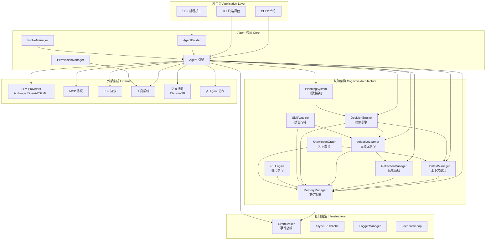
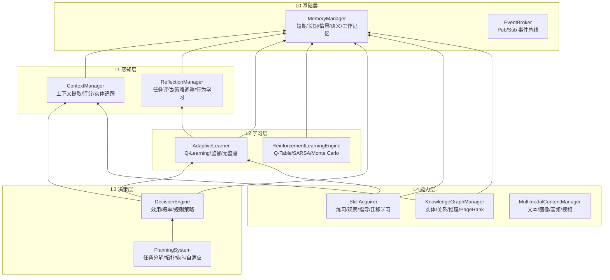
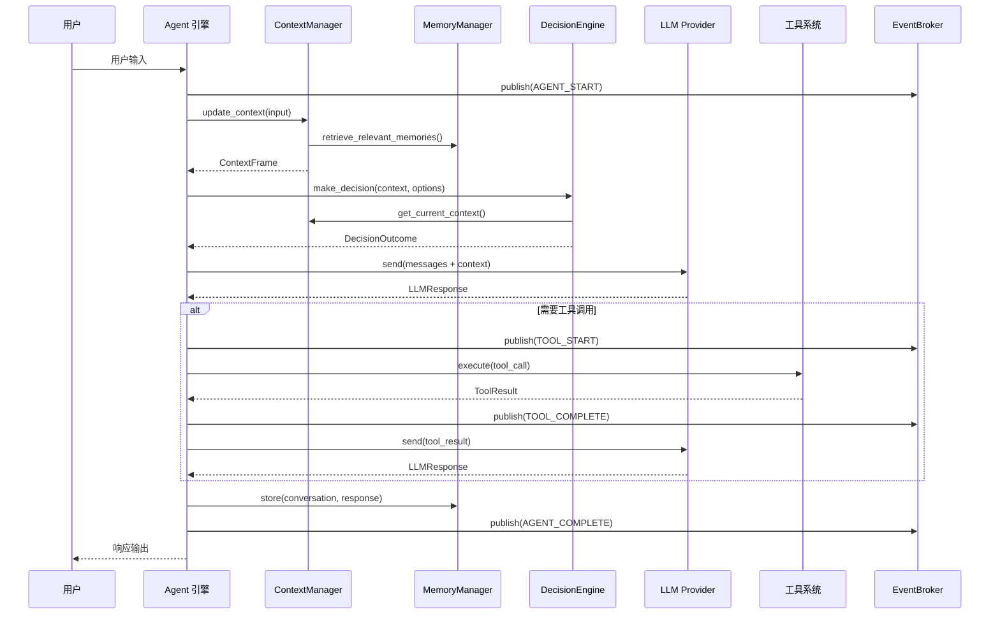
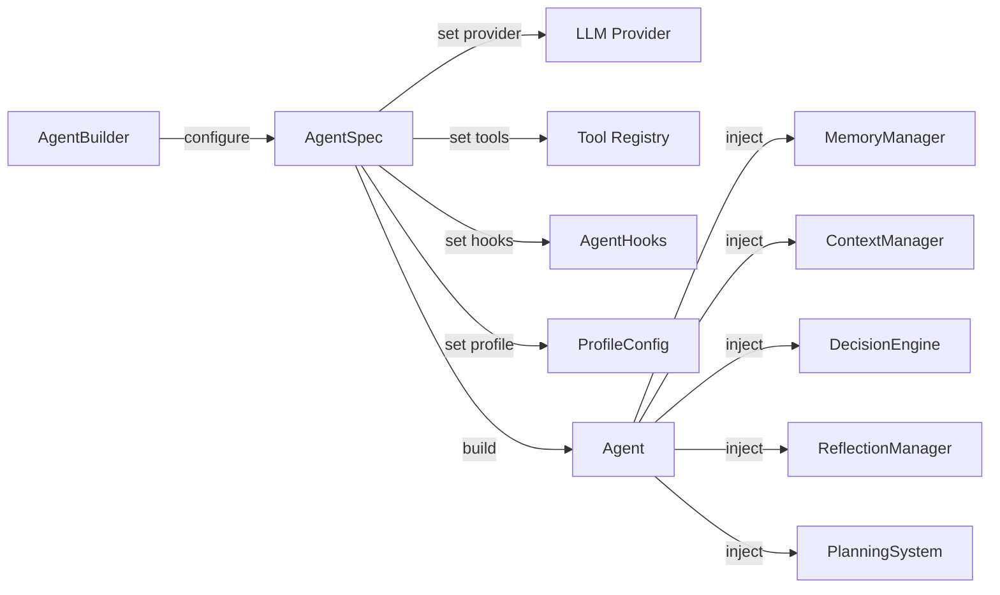

# 小铁 (XiaoTie) 架构设计文档

> 版本: 1.1.0 | 架构风格: Mini-Agent + 认知架构 | 参考: OpenCode

## 1. 系统概览

小铁是一个轻量级 AI Agent 框架，基于 Mini-Agent 架构设计，融合认知科学理论构建了完整的智能体认知系统。框架采用事件驱动、Mixin 组合、分层抽象三大核心模式，支持多 LLM Provider、MCP 协议、多 Agent 协作。

## 2. 模块关系图



## 3. 认知架构层次图



## 4. 数据流图



## 5. Agent 构建流程



## 6. 架构决策记录 (ADR)

### ADR-001: 采用 Mixin 模式实现认知能力组合

- **状态**: 已采纳
- **上下文**: Agent 需要灵活组合多种认知能力（记忆、上下文、决策、学习、反思），不同场景需要不同能力子集。
- **决策**: 使用 Python Mixin 类（如 `ReflectiveAgentMixin`、`LearningAgentMixin`）实现能力的按需组合，而非继承层次。
- **理由**: Mixin 避免了深层继承的脆弱性，允许用户自由组合所需能力，符合组合优于继承原则。每个 Mixin 独立管理自己的认知模块实例。
- **后果**: 用户可以通过多继承灵活组合能力；需要注意 MRO（方法解析顺序）和初始化顺序。

### ADR-002: 事件驱动的 Pub/Sub 架构

- **状态**: 已采纳
- **上下文**: Agent 运行过程中需要通知多个消费者（UI、日志、监控），且不能阻塞主流程。
- **决策**: 实现 `EventBroker` 作为全局事件总线，使用 `weakref` 管理订阅者，copy-on-read 模式发布事件。
- **理由**: 参考 OpenCode 的 Pub/Sub 设计。弱引用自动清理已销毁的订阅者，copy-on-read 避免发布时持锁，QueueFull 时丢弃旧事件保证非阻塞。
- **后果**: 完全解耦的事件通知；极端高频场景下可能丢失事件（有界队列设计取舍）。

### ADR-003: 策略模式实现可插拔算法

- **状态**: 已采纳
- **上下文**: 决策、学习、规划等模块需要支持多种算法，且允许用户自定义。
- **决策**: 每个认知模块定义抽象基类（`BaseDecisionPolicy`、`BaseLearningAlgorithm`、`BasePlanner`、`BaseReflector`），具体算法作为策略实现。
- **理由**: 策略模式使算法可独立变化和替换，新增算法只需实现接口，无需修改核心逻辑。
- **后果**: 高度可扩展；用户可注入自定义策略；接口稳定性需要维护。

### ADR-004: 分层记忆系统

- **状态**: 已采纳
- **上下文**: Agent 需要管理不同生命周期和用途的信息。
- **决策**: 实现五种记忆类型：SHORT_TERM（工作缓冲）、LONG_TERM（持久知识）、EPISODIC（事件序列）、SEMANTIC（概念网络）、WORKING（当前任务）。支持 InMemory 和 Database 两种后端。
- **理由**: 借鉴认知科学的多存储模型，不同记忆类型有不同的容量限制和清理策略，通过堆排序实现高效的容量管理。
- **后果**: 精细化的信息管理；记忆检索需要跨类型搜索时可能增加复杂度。

### ADR-005: Builder 模式构建 Agent

- **状态**: 已采纳
- **上下文**: Agent 配置项众多（LLM provider、工具、钩子、Profile、认知模块），直接构造函数参数过多。
- **决策**: 提供 `AgentBuilder` 链式 API，通过 `AgentSpec` 收集配置，最终 `build()` 生成 Agent 实例。
- **理由**: Builder 模式将复杂对象的构建与表示分离，链式调用提供流畅的 API 体验，同时支持 `create_agent()` 快捷函数。
- **后果**: 清晰的构建流程；支持渐进式配置；`create_agent()` 覆盖常见场景。

### ADR-006: 异步优先设计

- **状态**: 已采纳
- **上下文**: LLM 调用、工具执行、数据库操作均为 I/O 密集型。
- **决策**: 核心 API 全部采用 `async/await`，使用 `asyncio.Queue` 进行事件传递，`aiosqlite` 进行持久化。
- **理由**: 异步设计避免 I/O 阻塞，支持并发工具调用和流式响应，与现代 Python 异步生态一致。
- **后果**: 高并发性能；调用方需要在异步上下文中使用；提供 `publish_sync()` 兼容同步场景。

## 7. 核心设计模式

### 7.1 Mixin 组合模式

```python
# 每个认知能力通过 Mixin 提供，用户按需组合
class MyAgent(
    ReflectiveAgentMixin,    # 反思能力
    LearningAgentMixin,      # 学习能力
    ContextAwareAgentMixin,  # 上下文感知
    DecisionAwareAgentMixin, # 决策能力
):
    pass

# 每个 Mixin 在 __init_subclass__ 或显式初始化中
# 创建对应的认知模块实例
```

### 7.2 策略模式 (Strategy Pattern)

```
BaseDecisionPolicy          BaseLearningAlgorithm       BasePlanner
    |-- UtilityBased            |-- QLearning               |-- SimplePlanner
    |-- Probabilistic           |-- Supervised               |-- AdaptivePlanner
    |-- RuleBased               |-- Unsupervised

BaseReflector               BaseMemoryBackend           BaseKnowledgeGraphStore
    |-- TaskEvaluator           |-- InMemoryBackend         |-- NetworkXStore
    |-- StrategyAdjuster        |-- DatabaseBackend
    |-- KnowledgeUpdater
    |-- BehaviorLearner
    |-- PerformanceAnalyzer
```

### 7.3 观察者模式 (EventBroker)

```
EventBroker (全局单例)
    |
    |-- subscribe(event_types) -> Queue  (弱引用, 自动清理)
    |-- publish(event)                   (copy-on-read, 非阻塞)
    |-- publish_sync(event)              (同步兼容)
    |
    事件类型: AGENT_*, MESSAGE_*, THINKING_*, TOOL_*, TOKEN_*, SESSION_*, SYSTEM_*
```

### 7.4 模板方法模式

规划系统中 `BasePlanner.create_plan()` 定义规划骨架，`SimplePlanner` 和 `AdaptivePlanner` 实现具体步骤生成逻辑。反思系统中 `BaseReflector.reflect()` 定义反思流程，5 种反思器实现不同的分析维度。

### 7.5 依赖注入

认知模块通过构造函数注入依赖：
- `DecisionEngine(context_manager, learner, memory_manager)`
- `ReflectionManager(memory_manager)`
- `KnowledgeGraphManager(memory_manager)`

模块间通过接口而非具体实现耦合，支持测试时注入 Mock 对象。

## 8. 模块职责速查

| 模块 | 职责 | 关键类 | 依赖 |
|------|------|--------|------|
| memory | 多类型记忆存储与检索 | MemoryManager, ConversationMemory | Events |
| context | 上下文提取、评分、实体追踪 | ContextManager, ContextFrame | Memory |
| decision | 多策略决策与探索 | DecisionEngine, DecisionOutcome | Context, Learning, Memory |
| learning | 自适应学习与技能追踪 | AdaptiveLearner, Skill | Memory, Reflection |
| reflection | 多维度自我反思 | ReflectionManager, Reflection | Memory |
| planning | 任务分解与执行编排 | PlanningSystem, TaskManager | Decision |
| skills | 技能习得与发展阶段 | SkillAcquirer, SkillDevelopmentStage | Learning, Memory |
| rl | 强化学习引擎 | RLEngine, QTableLearner | Memory |
| kg | 知识图谱构建与查询 | KGManager, KGQueryEngine | Context, Memory |
| events | 事件驱动通信 | EventBroker, EventType | (无) |
| multimodal | 多模态内容处理 | MultimodalContentManager | (无) |