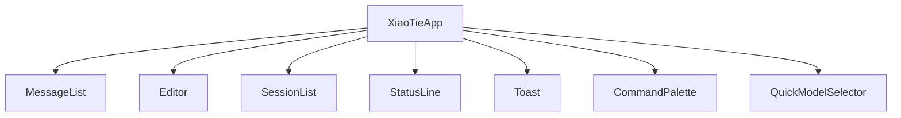

# 小铁 UI 组件库文档 v1.0

## 1. 组件总览

| 组件 | 文件 | 职责 |
|---|---|---|
| `ChatMessage` | `xiaotie/tui/widgets.py` | 统一消息渲染（用户/助手/工具/系统） |
| `MessageList` | `xiaotie/tui/widgets.py` | 消息容器、欢迎态、历史上限管理 |
| `Editor` | `xiaotie/tui/widgets.py` | 输入提交、处理态锁定、快捷提示 |
| `SessionItem` | `xiaotie/tui/widgets.py` | 单会话卡片，支持键盘与点击触发 |
| `SessionList` | `xiaotie/tui/widgets.py` | 会话侧栏展示与刷新 |
| `StatusLine` | `xiaotie/tui/widgets.py` | 运行状态总览 |
| `Toast` | `xiaotie/tui/widgets.py` | 轻量反馈通知 |
| `CommandPalette` | `xiaotie/tui/command_palette.py` | 模糊搜索命令面板 |
| `QuickModelSelector` | `xiaotie/tui/command_palette.py` | 模型快速切换与搜索 |

## 2. 组件契约

### 2.1 ChatMessage

- 输入：`role`、`content`、`thinking`、`tool_name`、`is_error`。
- 输出：结构化消息块，含角色与时间信息。
- 约束：工具与思考内容必须截断显示，防止长文本阻塞渲染。

### 2.2 MessageList

- 输入：`add_message(...)`。
- 输出：滚动到底、自动移除欢迎态。
- 性能策略：最多保留 200 条 `ChatMessage`，超出后自动裁剪旧消息。

### 2.3 Editor

- 输入：用户文本。
- 输出：`Submitted` 事件。
- 状态：`processing=true` 时禁用输入，展示处理中占位符。

### 2.4 SessionItem

- 输入：`session_id`、`title`、`message_count`、`is_current`。
- 输出：`Selected(session_id)`。
- 无障碍：支持 `Enter` 触发，支持焦点高亮。

### 2.5 CommandPalette

- 输入：命令查询文本。
- 输出：命令选择结果。
- 交互：方向键导航 + Enter 执行 + Esc 关闭。

### 2.6 QuickModelSelector

- 输入：模型查询文本。
- 输出：`(provider, model)`。
- 交互：搜索 + 分组展示 + 键盘导航。

## 3. 组合关系



## 4. 组件状态矩阵

| 组件 | 默认 | Hover | Focus | Processing | Error |
|---|---|---|---|---|---|
| ChatMessage | surface | - | - | - | error 背景/边框 |
| Editor Input | 透明背景 | - | active border | disabled + warning | - |
| SessionItem | 常态边框 | primary 20% | active border | - | - |
| Toast | info | - | - | - | error/warning/success 变体 |

## 5. 使用示例

```python
messages.add_message("assistant", "已完成分析", thinking="先比对差异，再生成路线图")
app.show_toast("模型已切换", "openai / gpt-4o", variant="success")
```

## 6. 禁止用法

- 在主链路直接渲染超长原始工具输出，不经截断。
- 仅依赖颜色表达状态，不提供文本状态说明。
- 在处理态允许重复提交，导致并发请求堆积。
