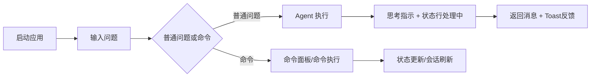

# 小铁 UI 交互原型（终端版）

## 1. 关键用户流



## 2. 主界面原型

```text
┌──────────────────────────────────────────────────────────────────────────────┐
│ Header: 小铁 XiaoTie                                                        │
├──────────────────────────────────────────────────────────────────────────────┤
│ 消息主区 (MessageList)                           │ 会话侧栏 (SessionList)   │
│ ┌──────────────────────────────────────────────┐ │ ┌──────────────────────┐ │
│ │ 用户: 请分析这个错误                          │ │ │ 当前会话             │ │
│ │ 助手: 已定位根因并给出修复方案                │ │ │ 历史会话列表         │ │
│ │ 工具: read_file(...)                          │ │ │ Enter/点击可切换     │ │
│ └──────────────────────────────────────────────┘ │ └──────────────────────┘ │
├──────────────────────────────────────────────────────────────────────────────┤
│ Editor: Enter发送 / 命令 / Ctrl+K / Ctrl+M / Ctrl+T                         │
├──────────────────────────────────────────────────────────────────────────────┤
│ StatusLine: 模型 | Token | 会话 | 状态 | 模式 | 主题                        │
└──────────────────────────────────────────────────────────────────────────────┘
```

## 3. 命令面板原型

```text
┌──────────────────────────────────────────────┐
│ 󰌌 命令面板                                   │
├──────────────────────────────────────────────┤
│ [ 输入命令或搜索... ]                         │
├──────────────────────────────────────────────┤
│ /help      显示帮助                           │
│ /new       创建新会话                         │
│ /themes    主题列表                           │
│ /status    显示系统状态                       │
├──────────────────────────────────────────────┤
│ ↑↓ 导航   Enter 执行   Esc 关闭               │
└──────────────────────────────────────────────┘
```

## 4. 模型切换原型

```text
┌──────────────────────────────────────────────┐
│ 󰚩 选择模型                                   │
├──────────────────────────────────────────────┤
│ [ 搜索模型... ]                               │
├──────────────────────────────────────────────┤
│ ANTHROPIC                                     │
│   claude-sonnet-4-20250514  ✓                │
│ OPENAI                                        │
│   gpt-4o                                      │
│   gpt-4o-mini                                 │
└──────────────────────────────────────────────┘
```

## 5. 响应式行为原型

- 宽度 >= 130：双栏布局（主区 + 侧栏）。
- 宽度 110~129：侧栏压缩宽度。
- 宽度 < 110：隐藏侧栏，保留主区与输入区。

## 6. 交互反馈原型

- 成功：右上角 `success Toast`。
- 警告：`warning Toast` + 命令提示。
- 错误：`error Toast` + 恢复引导（如 `/help`）。
