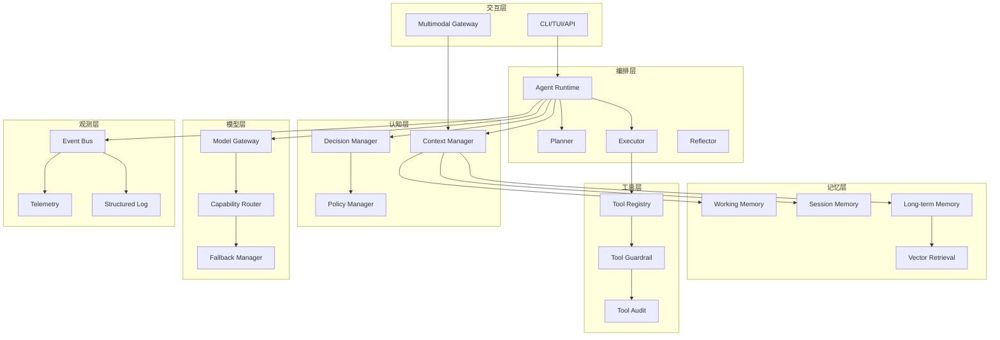

# 小铁现代 AI Agent 重构蓝图（完整版）

## 1. 背景与目标

当前项目已具备 Agent 循环、工具执行、事件总线、权限与观测等基础能力，但存在“能力资产分散、主链路耦合不足、架构文档与代码偏差”的问题。重构目标是将小铁升级为支持现代 Agent 核心特性的工程化平台：

- 多模态交互（文本/图像/音频/视频输入输出）
- 统一记忆管理（短期/长期/工作记忆 + 检索增强）
- 可编排的工具调用机制（安全、审计、并发、回滚）
- 任务规划与执行（Plan-Act-Observe-Reflect）
- 上下文理解与压缩（动态窗口、语义检索、优先级注入）
- 自主决策与策略切换（规则 + 学习 + 反馈）

## 2. 现状诊断（基于代码）

### 2.1 已有优势

- 主执行循环清晰，工具调用闭环完整
- 事件、权限、遥测已有基础实现
- MCP、插件、多 Provider 已接入
- 多 Agent 与记忆模块已有雏形

### 2.2 关键缺口

- 认知模块（Context/Decision/Planning/Learning）未进入主执行链路
- 记忆与语义检索未形成统一的上下文编排入口
- 多模态能力缺少统一协议层与调度层
- 多 Agent 与主 Agent 接口存在漂移
- 能力矩阵未驱动运行时自动降级

## 3. 重构原则

- 主链路最小化：所有高级能力通过中间层注入，不污染核心循环
- 协议优先：先抽象接口，再替换实现
- 可观测先行：新模块必须具备指标与审计字段
- 安全默认开启：高风险动作必须审批，可灰度降级
- 渐进迁移：兼容旧 CLI/TUI 与旧工具接口

## 4. 目标架构（V2）



## 5. 模块划分与职责

| 模块 | 职责 | 关键输出 |
|---|---|---|
| `xiaotie/runtime/` | 统一 Agent 生命周期与状态机 | step 状态、执行快照 |
| `xiaotie/planning/` | 任务分解、依赖拓扑、重规划 | PlanGraph、TaskNode |
| `xiaotie/context/` | 上下文融合、预算分配、压缩策略 | ContextBundle |
| `xiaotie/memory_v2/` | 多层记忆写入/检索/遗忘策略 | MemoryRecord、RecallSet |
| `xiaotie/decision/` | 策略路由、动作选择、风险权衡 | DecisionResult |
| `xiaotie/tooling/` | 工具注册、权限、审计、重试 | ToolExecutionReport |
| `xiaotie/multimodal/` | 媒体编解码与模态路由 | MultiModalMessage |
| `xiaotie/model_gateway/` | Provider 统一协议与能力协商 | ModelResponse、CapabilityProfile |
| `xiaotie/eval/` | 离线评测、回归基准、A/B | EvalReport |

## 6. 接口设计（核心协议）

### 6.1 Runtime 与 Planner

```python
class Planner(Protocol):
    async def build_plan(self, goal: str, context: "ContextBundle") -> "PlanGraph": ...
    async def replan(self, state: "RuntimeState", feedback: "ExecutionFeedback") -> "PlanGraph": ...
```

### 6.2 Context Manager

```python
class ContextManager(Protocol):
    async def compose(self, query: str, session_id: str, token_budget: int) -> "ContextBundle": ...
    async def update(self, event: "Event") -> None: ...
```

### 6.3 Memory Store

```python
class MemoryStore(Protocol):
    async def write(self, record: "MemoryRecord") -> str: ...
    async def recall(self, query: str, top_k: int, scope: str) -> list["MemoryRecord"]: ...
    async def compact(self, policy: "CompactionPolicy") -> "CompactionResult": ...
```

### 6.4 Tool Runtime

```python
class ToolRuntime(Protocol):
    async def execute(self, call: "ToolCall", policy: "ExecutionPolicy") -> "ToolExecutionReport": ...
```

### 6.5 Model Gateway

```python
class ModelGateway(Protocol):
    async def chat(self, req: "ModelRequest") -> "ModelResponse": ...
    async def stream(self, req: "ModelRequest") -> AsyncIterator["ModelDelta"]: ...
    def capabilities(self, provider: str, model: str) -> "CapabilityProfile": ...
```

## 7. 数据流设计

### 7.1 主链路（Plan-Act-Observe-Reflect）

1. 输入进入 `ContextManager.compose`
2. `Planner.build_plan` 生成任务图（可并行节点）
3. `Executor` 按依赖执行工具/模型动作
4. 每一步写入 Event + Telemetry + Audit
5. `Reflector` 判断是否重规划或结束
6. 输出汇总并写回 Memory

### 7.2 多模态链路

1. 多模态网关将媒体转为标准 `MultiModalMessage`
2. 路由到支持对应 capability 的模型
3. 如需工具处理（OCR/ASR/Video parse），由 ToolRuntime 执行
4. 结构化结果注入 ContextBundle 后再推理

## 8. 技术选型建议

| 方向 | 方案 | 说明 |
|---|---|---|
| 配置与模型 | Pydantic v2 | 统一配置校验与协议对象 |
| 向量检索 | ChromaDB（现有）+ 可插拔接口 | 兼容后续迁移 pgvector |
| 事件与指标 | EventBroker + Prometheus + OTel | 现有事件系统平滑扩展 |
| 工作流编排 | 自研 PlanGraph（轻量） | 比引入重量 DAG 引擎更可控 |
| 多模态处理 | Provider 原生 + 工具回退 | 降低耦合，优先能力路由 |
| 持久化 | SQLite（现有）+ 分层表设计 | 后续可升级到 Postgres |

## 9. 性能优化策略

### 9.1 推理与上下文

- 动态 token 预算分配：系统提示/记忆/检索/工具结果分桶
- 两级缓存：Prompt 片段缓存 + 检索结果缓存
- 语义去重：重复工具结果不重复入上下文

### 9.2 工具执行

- 任务图级并行：仅并行无依赖节点
- 工具超时与重试策略模板化
- 高成本工具熔断与降级路径

### 9.3 存储与检索

- Memory 分层索引（session_id、timestamp、topic）
- 热数据留内存、冷数据异步落盘
- 批量写入 + 周期压缩

### 9.4 观测与调优

- 核心指标：成功率、P95 时延、重规划率、工具失败率、上下文命中率
- 回归基准：固定任务集 + 固定模型配置 + 成本统计

## 10. 分阶段实施路线图

### Phase 0：架构对齐（1 周）
- 产出：V2 ADR、接口契约、迁移清单
- 验收：主链路接口评审通过

### Phase 1：Runtime + Context + Memory 打通（2 周）
- 产出：ContextBundle、MemoryStore V2、兼容适配层
- 验收：单会话与跨会话记忆回忆可用

### Phase 2：Planner/Executor 上线（2 周）
- 产出：PlanGraph、重规划机制、执行报告
- 验收：复杂任务成功率提升、步骤可追踪

### Phase 3：多模态与能力路由（2 周）
- 产出：MultiModal Gateway、Capability Router
- 验收：图文/语音输入链路通过

### Phase 4：评测与稳定性强化（1-2 周）
- 产出：Benchmark、回归集、压测报告
- 验收：P95 和错误率达到门禁标准

## 11. 测试验证方案

### 11.1 测试层级

- 单元测试：协议实现、策略分支、异常路径
- 集成测试：计划-执行-重规划闭环
- 端到端测试：真实任务集 + 工具链
- 非功能测试：并发、长会话、资源占用、成本

### 11.2 关键验收指标

- 任务完成率 ≥ 基线 +15%
- 工具调用成功率 ≥ 98%
- 高风险操作误放行率 = 0
- 记忆检索命中率 ≥ 85%
- P95 总时延不劣化（或下降）

## 12. 风险与应对

- 架构漂移风险：每阶段强制 ADR 与接口评审
- 多模态成本风险：能力路由优先低成本模型
- 兼容性风险：提供 V1 Adapter，分流迁移
- 安全误拦截风险：灰度开关 + 白名单 + 审计回放

