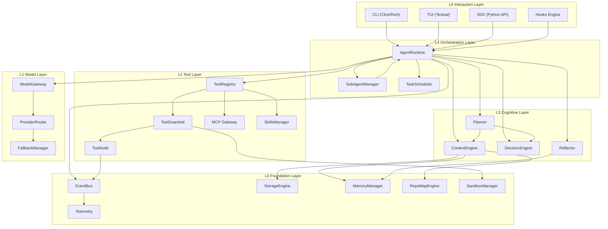
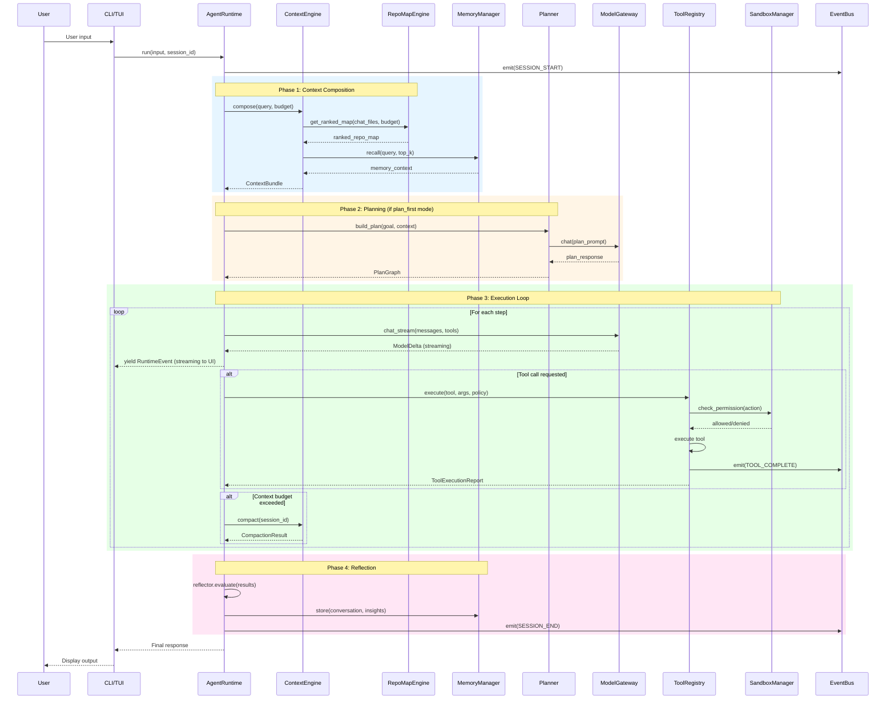
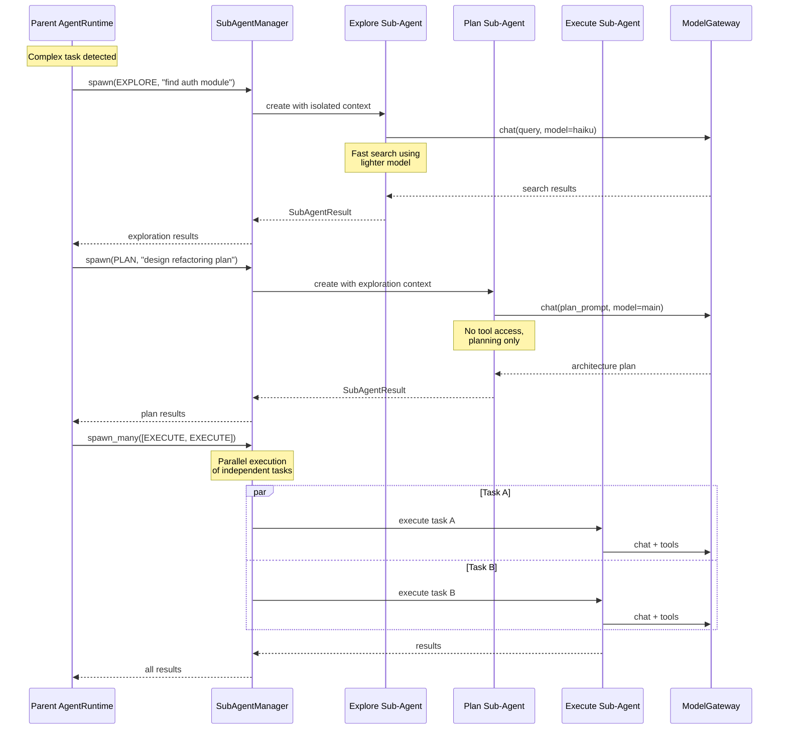
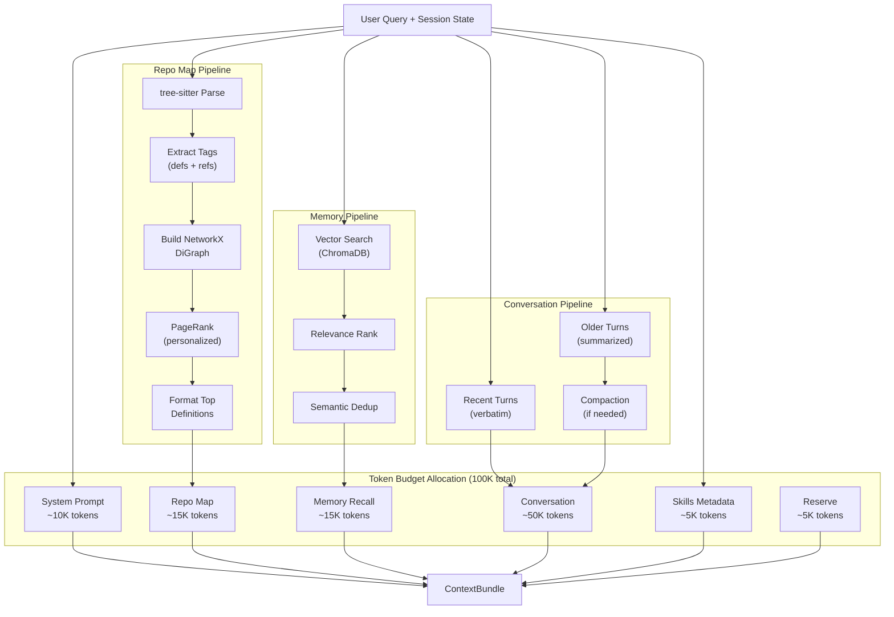
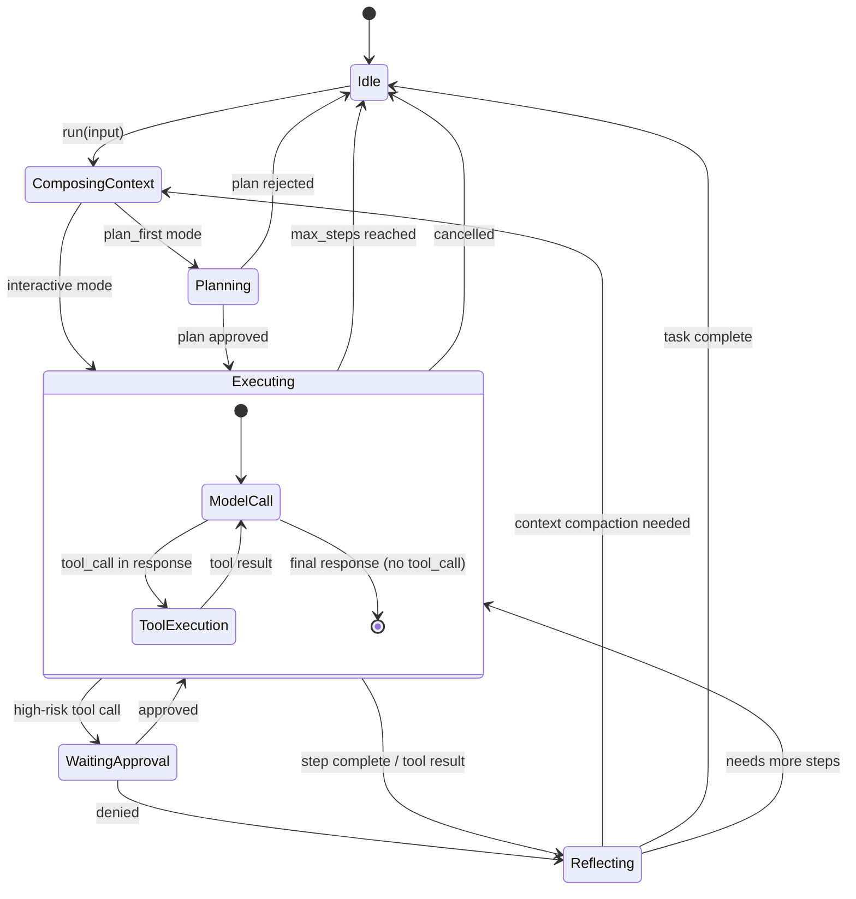
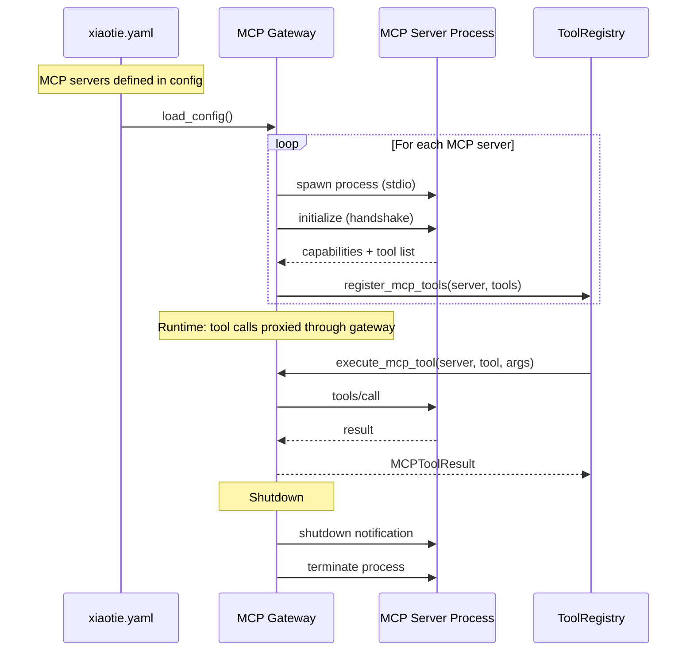
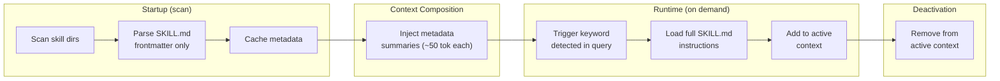

# Xiaotie v2.0 Technical Blueprint

> Version: Draft 1.0 | Date: 2026-03-06
> Author: Research Agent | Based on: competitor-analysis.md + modern-agent-refactor-blueprint.md
> Status: DRAFT - Pending team review

---

## 1. Vision & Goals

Xiaotie v2.0 evolves from a lightweight AI Agent framework (v1.1.0) into a **production-grade coding CLI agent** that combines the best architectural patterns from industry leaders:

| Goal | Inspiration | v1.1 Gap |
|------|-------------|----------|
| Sub-agent delegation with isolated context | Claude Code (Explore/Plan/Execute) | Multi-agent exists but no context isolation |
| Tree-sitter repo map with PageRank | Aider | RepoMap uses regex, no graph ranking |
| MCP-first plugin ecosystem | Goose, Gemini CLI | MCP client exists but not extensible |
| OS-level sandboxing | Claude Code (Seatbelt/bubblewrap) | Sandbox is subprocess/Docker only, no OS-level |
| Skills with progressive disclosure | Claude Code, Codex CLI | No skills system |
| Async sub-agent trees | Cursor | Orchestrator is sequential/parallel only |

### Non-Goals for v2.0
- Full Rust rewrite (incremental Rust for perf-critical paths only)
- Cloud execution / remote VMs (deferred to v3.0)
- IDE extension / ACP server (deferred to v2.1)

---

## 1.1 V1.1 Audit Findings (Prerequisites for v2.0)

The codebase audit (`codebase-audit.md`) and security audit (`security-audit-v2.md`) identified critical issues that v2.0 must resolve by design, not as patches:

### Critical Security Findings (from security-audit-v2.md)

| ID | Severity | Issue | V2.0 Resolution |
|----|----------|-------|-----------------|
| SEC-001 | CRITICAL | Hardcoded API key in `config/config.yaml` | ModelGateway reads credentials exclusively from env vars / keychain; config files only store non-secret settings |
| SEC-002 | CRITICAL | No path traversal protection in file tools | SandboxManager enforces workspace-scoped filesystem access at OS level (Seatbelt/Landlock); ToolGuardrail validates resolved paths |
| SEC-003 | CRITICAL | Unrestricted shell command execution (BashTool) | All shell execution routed through SandboxManager; default policy is deny-network, workspace-only filesystem |
| SEC-004 | HIGH | Unsafe pickle deserialization from database | StorageEngine uses JSON-only serialization; pickle removed entirely |
| SEC-005 | HIGH | SQL injection vectors in QueryBuilder | All DB access via parameterized queries through StorageEngine; raw SQL prohibited |

### Critical Code Quality Findings (from codebase-audit.md)

| ID | Severity | Issue | V2.0 Resolution |
|----|----------|-------|-----------------|
| P0-1 | CRITICAL | PythonTool missing `await` on sandbox call | ToolRegistry enforces async execution contract; type-checked with Protocol |
| P0-2 | CRITICAL | Metrics server binds to 0.0.0.0 | Telemetry module defaults to 127.0.0.1; external binding requires explicit opt-in |
| P0-3 | CRITICAL | No input sanitization on bash commands | SandboxManager + ToolGuardrail pipeline; deny-by-default for unrecognized commands |
| P0-4 | CRITICAL | Sensitive output filter bypassable | Replaced with entropy-based secret detection in ToolAudit |
| P1-2 | HIGH | `_execute_single_tool` is 183 lines CC=13 | Replaced by ToolRegistry.execute() with guardrail pipeline (5 discrete stages) |
| P1-4 | HIGH | `openai_client.py:generate_stream` CC=32 | Replaced by ModelGateway with per-provider strategy classes |
| P1-6 | HIGH | 24% test coverage | v2.0 target: >= 80% for new modules; integration tests for agent loop mandatory |
| P1-7 | HIGH | Global mutable singletons without thread safety | Dependency injection via AgentRuntime constructor; no global singletons in new code |

These findings directly shaped the v2.0 architecture decisions below -- particularly the SandboxManager, ToolGuardrail pipeline, ModelGateway provider abstraction, and dependency injection patterns.

---

## 2. System Architecture

### 2.1 Layer Architecture



### 2.2 Module Directory Structure

```
xiaotie/
  __init__.py              # v2.0.0

  # L5: Interaction Layer (KEEP existing, extend)
  cli.py                   # CLI entry (extend with skill invocation)
  tui/                     # TUI (keep Textual)
  hooks.py                 # NEW: lifecycle hooks engine

  # L4: Orchestration Layer (REFACTOR)
  runtime/
    __init__.py
    agent_runtime.py       # NEW: unified agent lifecycle & state machine
    sub_agent.py           # NEW: sub-agent spawning & context isolation
    scheduler.py           # NEW: async task scheduler with DAG support

  # L3: Cognitive Layer (REFACTOR from existing cognitive modules)
  context/
    __init__.py
    engine.py              # REFACTOR: context composition with token budgeting
    compactor.py           # NEW: context compaction strategies
    bundle.py              # NEW: ContextBundle data structure
  planner/
    __init__.py
    planner.py             # REFACTOR from planning/core.py
    plan_graph.py          # NEW: DAG-based plan representation
  decision/
    __init__.py
    engine.py              # KEEP: DecisionEngine (already good)
  reflector/
    __init__.py
    reflector.py           # REFACTOR from reflection system

  # L2: Tool Layer (EXTEND)
  tools/                   # KEEP existing tools
    base.py                # EXTEND: add guardrail integration
    registry.py            # NEW: centralized tool registry with categories
  mcp/                     # KEEP existing MCP client
    gateway.py             # NEW: MCP server aggregator & lifecycle
  skills/
    __init__.py
    manager.py             # NEW: skills discovery, progressive disclosure
    skill.py               # NEW: Skill data model (SKILL.md parser)

  # L1: Model Layer (REFACTOR)
  model/
    __init__.py
    gateway.py             # REFACTOR from llm/: unified model gateway
    provider.py            # REFACTOR: provider abstraction
    router.py              # NEW: capability-based routing
    fallback.py            # NEW: fallback chain with circuit breaker

  # L0: Foundation Layer (EXTEND)
  events.py                # KEEP (already solid)
  storage/                 # KEEP existing
  memory/                  # KEEP existing, extend with v2 features
  repomap/
    __init__.py
    engine.py              # NEW: tree-sitter based repo map
    graph.py               # NEW: dependency graph + PageRank
    cache.py               # NEW: persistent tag cache
  sandbox/
    __init__.py
    manager.py             # REFACTOR: multi-backend sandbox manager
    seatbelt.py            # NEW: macOS Seatbelt integration
    landlock.py            # NEW: Linux Landlock integration
    docker.py              # KEEP: Docker sandbox
  permissions.py           # KEEP (extend with mode system)
  telemetry.py             # KEEP

  # Legacy compatibility
  agent/                   # KEEP: v1 Agent class with deprecation shims
  llm/                     # KEEP: v1 LLM clients, re-export through model/
  orchestrator.py          # KEEP: v1 orchestrator, deprecated
```

---

## 3. Core Interfaces & Contracts

### 3.1 AgentRuntime (L4 - Orchestration)

The central coordinator replacing the current `Agent` class as the execution engine.

```python
# xiaotie/runtime/agent_runtime.py

from __future__ import annotations
from typing import AsyncIterator, Optional, Protocol
from dataclasses import dataclass, field
from enum import Enum
import asyncio

class RuntimeMode(Enum):
    """Agent execution mode"""
    INTERACTIVE = "interactive"   # Normal REPL
    PLAN_FIRST = "plan_first"     # Plan then execute (Cline-inspired)
    AUTONOMOUS = "autonomous"     # Long-running autonomous

class RuntimePhase(Enum):
    """Current phase in the agent loop"""
    IDLE = "idle"
    COMPOSING_CONTEXT = "composing_context"
    PLANNING = "planning"
    EXECUTING = "executing"
    REFLECTING = "reflecting"
    WAITING_APPROVAL = "waiting_approval"

@dataclass
class RuntimeState:
    """Immutable snapshot of runtime state"""
    session_id: str
    phase: RuntimePhase
    step_count: int
    total_tokens: int
    token_budget: int
    active_sub_agents: int
    plan_id: Optional[str] = None

@dataclass
class RuntimeConfig:
    """Runtime configuration"""
    mode: RuntimeMode = RuntimeMode.INTERACTIVE
    max_steps: int = 50
    token_budget: int = 100_000
    parallel_tools: bool = True
    enable_thinking: bool = True
    stream: bool = True
    auto_compact_threshold: float = 0.8  # compact at 80% budget
    sub_agent_model: Optional[str] = None  # lighter model for sub-agents

class AgentRuntime:
    """Unified agent lifecycle manager.

    Replaces the v1 Agent class as the primary execution engine.
    The v1 Agent class remains as a compatibility shim.
    """

    def __init__(
        self,
        config: RuntimeConfig,
        context_engine: ContextEngine,
        model_gateway: ModelGateway,
        tool_registry: ToolRegistry,
        planner: Planner,
        reflector: Reflector,
        sandbox_manager: SandboxManager,
        event_bus: EventBus,
        hooks: Optional[HooksEngine] = None,
    ):
        self._config = config
        self._context = context_engine
        self._model = model_gateway
        self._tools = tool_registry
        self._planner = planner
        self._reflector = reflector
        self._sandbox = sandbox_manager
        self._events = event_bus
        self._hooks = hooks
        self._state = RuntimeState(
            session_id="",
            phase=RuntimePhase.IDLE,
            step_count=0,
            total_tokens=0,
            token_budget=config.token_budget,
            active_sub_agents=0,
        )
        self._sub_agents: dict[str, SubAgentHandle] = {}

    async def run(self, user_input: str, session_id: str) -> AsyncIterator[RuntimeEvent]:
        """Main agent loop. Yields events for UI consumption.

        The loop follows Plan-Act-Observe-Reflect:
        1. Compose context (repo map + memory + conversation)
        2. Plan (optional, based on mode)
        3. Execute (tool calls with guardrails)
        4. Reflect (evaluate, decide to replan or finish)
        """
        ...

    async def spawn_sub_agent(
        self,
        agent_type: SubAgentType,
        task: str,
        context_subset: ContextBundle,
    ) -> SubAgentHandle:
        """Spawn an isolated sub-agent with its own context window.

        Sub-agent types:
        - EXPLORE: Fast search/read using smaller model (e.g., Haiku)
        - PLAN: Architecture planning using main model
        - EXECUTE: Task execution with full tool access
        """
        ...

    async def cancel(self) -> None:
        """Gracefully cancel the current run and all sub-agents."""
        ...

    @property
    def state(self) -> RuntimeState:
        """Current runtime state snapshot."""
        return self._state
```

### 3.2 ContextEngine (L3 - Cognitive)

Replaces the regex-based `RepoMap` and basic `ContextManager` with a tree-sitter-powered engine.

```python
# xiaotie/context/engine.py

from typing import Protocol

class ContextEngine(Protocol):
    """Composes context for LLM calls within a token budget.

    Combines:
    - Repo map (tree-sitter AST + PageRank ranking)
    - Conversation history (with compaction)
    - Memory recall (semantic search)
    - Active skills metadata
    - System instructions (XIAOTIE.md hierarchy)
    """

    async def compose(
        self,
        query: str,
        session_id: str,
        token_budget: int,
        active_files: list[str] | None = None,
    ) -> ContextBundle:
        """Compose a context bundle within the token budget.

        Budget allocation strategy:
        - System prompt: ~10% (fixed)
        - Repo map: ~15% (dynamic, PageRank-ranked)
        - Memory: ~15% (semantic recall)
        - Conversation: ~50% (recent turns, compacted older)
        - Skills metadata: ~5% (progressive disclosure)
        - Reserve: ~5% (for tool results)
        """
        ...

    async def compact(self, session_id: str) -> CompactionResult:
        """Compact conversation history when approaching budget.

        Strategy:
        1. Summarize older turns (keep last N verbatim)
        2. Externalize plans to filesystem (Cursor pattern)
        3. Drop redundant tool output
        """
        ...

    async def update(self, event: RuntimeEvent) -> None:
        """Update context state based on runtime events."""
        ...


@dataclass
class ContextBundle:
    """Complete context package for an LLM call."""
    system_prompt: str
    repo_map: str           # Tree-sitter ranked map
    memory_context: str     # Retrieved memories
    conversation: list[Message]  # Compacted conversation
    skills_metadata: str    # Active skills metadata
    active_files: list[str] # Files currently in focus
    token_usage: TokenUsage # Budget tracking

@dataclass
class TokenUsage:
    """Token budget tracking."""
    budget: int
    system: int
    repo_map: int
    memory: int
    conversation: int
    skills: int
    remaining: int
```

### 3.3 RepoMapEngine (L0 - Foundation)

The core innovation - replacing regex-based extraction with tree-sitter AST + PageRank.

```python
# xiaotie/repomap/engine.py

from typing import Protocol
from dataclasses import dataclass

@dataclass
class Tag:
    """Code identifier extracted from source."""
    rel_fname: str      # Relative file path
    fname: str          # Absolute file path
    line: int           # Line number
    name: str           # Identifier name
    kind: str           # "def" or "ref"

@dataclass
class RepoMapConfig:
    """Repo map configuration."""
    max_map_tokens: int = 1024        # Default map token budget
    max_file_size: int = 100_000      # Skip files larger than this
    cache_dir: str = ".xiaotie/cache"  # Tag cache location

class RepoMapEngine(Protocol):
    """Tree-sitter based repository map with PageRank ranking.

    Architecture (from Aider):
    1. Parse source files with tree-sitter -> extract Tags
    2. Build dependency graph (files as nodes, cross-file refs as edges)
    3. Rank with PageRank (personalized to current query/files)
    4. Format top-ranked definitions within token budget
    """

    def get_ranked_map(
        self,
        chat_files: list[str],
        other_files: list[str],
        max_tokens: int,
    ) -> str:
        """Generate a ranked repo map.

        Args:
            chat_files: Files actively being discussed (boost their refs)
            other_files: All other repo files
            max_tokens: Maximum tokens for the output map

        Returns:
            Formatted repo map string with most important definitions
        """
        ...

    def get_tags(self, fname: str) -> list[Tag]:
        """Extract tags from a file using tree-sitter.

        Uses disk cache (keyed by fname + mtime) for performance.
        Falls back to regex extraction if tree-sitter parser unavailable.
        """
        ...

    def invalidate_cache(self, fnames: list[str] | None = None) -> None:
        """Invalidate tag cache for specific files or all files."""
        ...
```

### 3.4 SubAgentManager (L4 - Orchestration)

Enables Claude Code-style sub-agent delegation with isolated context.

```python
# xiaotie/runtime/sub_agent.py

from enum import Enum
from dataclasses import dataclass

class SubAgentType(Enum):
    """Sub-agent specializations (inspired by Claude Code)."""
    EXPLORE = "explore"    # Codebase search, fast model, read-only tools
    PLAN = "plan"          # Architecture planning, main model, no tools
    EXECUTE = "execute"    # Task execution, main model, full tools

@dataclass
class SubAgentConfig:
    """Configuration for a sub-agent."""
    agent_type: SubAgentType
    model_override: str | None = None  # Use lighter model for EXPLORE
    tool_whitelist: list[str] | None = None  # Restrict tool access
    token_budget: int = 20_000  # Separate context window
    timeout: float = 60.0

@dataclass
class SubAgentHandle:
    """Handle to a running sub-agent."""
    id: str
    agent_type: SubAgentType
    status: str  # "running", "completed", "failed", "cancelled"

    async def wait(self) -> SubAgentResult:
        """Wait for sub-agent completion."""
        ...

    async def cancel(self) -> None:
        """Cancel the sub-agent."""
        ...

@dataclass
class SubAgentResult:
    """Result from a sub-agent execution."""
    agent_id: str
    agent_type: SubAgentType
    output: str
    tokens_used: int
    tool_calls: int
    duration: float

class SubAgentManager:
    """Manages sub-agent lifecycle and context isolation.

    Key design decisions:
    - Each sub-agent gets its own context window (not shared with parent)
    - EXPLORE agents use a lighter/faster model (e.g., Haiku)
    - PLAN agents have read-only access (no tool execution)
    - EXECUTE agents inherit parent's tool permissions
    - Parent receives only the final result, not intermediate steps
    - Multiple sub-agents can run concurrently (async)
    """

    def __init__(
        self,
        model_gateway: ModelGateway,
        tool_registry: ToolRegistry,
        sandbox_manager: SandboxManager,
        event_bus: EventBus,
    ):
        ...

    async def spawn(
        self,
        config: SubAgentConfig,
        task: str,
        context: ContextBundle,
    ) -> SubAgentHandle:
        """Spawn a new sub-agent with isolated context."""
        ...

    async def spawn_many(
        self,
        configs: list[tuple[SubAgentConfig, str, ContextBundle]],
    ) -> list[SubAgentHandle]:
        """Spawn multiple sub-agents concurrently."""
        ...

    async def cancel_all(self) -> None:
        """Cancel all running sub-agents."""
        ...
```

### 3.5 SkillsManager (L2 - Tool Layer)

Claude Code / Codex-inspired skills system with progressive disclosure.

```python
# xiaotie/skills/manager.py

from dataclasses import dataclass
from pathlib import Path

@dataclass
class SkillMetadata:
    """Skill metadata (loaded at startup, lightweight)."""
    name: str
    description: str
    triggers: list[str]     # Keywords that activate this skill
    version: str = "1.0"
    author: str = ""
    auto_activate: bool = False  # Activate without explicit trigger

@dataclass
class Skill:
    """Full skill definition (loaded on demand)."""
    metadata: SkillMetadata
    instructions: str       # Full SKILL.md content
    tools: list[str]        # Tools this skill may use
    examples: list[str]     # Usage examples

class SkillsManager:
    """Skills discovery and progressive disclosure.

    Progressive disclosure strategy:
    1. At startup: scan skill directories, load only SkillMetadata
    2. During context composition: include metadata summaries (~50 tokens each)
    3. When skill is triggered: load full instructions into context

    Skill locations (in priority order):
    1. .xiaotie/skills/ (project-level)
    2. ~/.xiaotie/skills/ (user-level)
    3. Built-in skills (bundled with xiaotie)
    """

    def __init__(self, skill_dirs: list[Path] | None = None):
        ...

    def scan(self) -> list[SkillMetadata]:
        """Scan all skill directories and load metadata."""
        ...

    def get_metadata_summary(self) -> str:
        """Get a compact summary of all skills for context injection.

        Format: "Available skills: [skill1: desc], [skill2: desc], ..."
        """
        ...

    def load_skill(self, name: str) -> Skill:
        """Load full skill instructions (on demand)."""
        ...

    def match_skills(self, query: str) -> list[SkillMetadata]:
        """Find skills matching a query by trigger keywords."""
        ...
```

### 3.6 HooksEngine (L5 - Interaction)

Lifecycle hooks for automation and enforcement.

```python
# xiaotie/hooks.py

from dataclasses import dataclass
from enum import Enum
from typing import Callable, Awaitable, Any

class HookEvent(Enum):
    """Events that can trigger hooks."""
    PRE_TOOL_CALL = "pre_tool_call"
    POST_TOOL_CALL = "post_tool_call"
    PRE_MODEL_CALL = "pre_model_call"
    POST_MODEL_CALL = "post_model_call"
    PRE_FILE_WRITE = "pre_file_write"
    POST_FILE_WRITE = "post_file_write"
    SESSION_START = "session_start"
    SESSION_END = "session_end"
    CONTEXT_COMPACT = "context_compact"

@dataclass
class HookDefinition:
    """Hook definition from configuration."""
    event: HookEvent
    command: str           # Shell command or Python callable path
    description: str = ""
    blocking: bool = True  # If True, waits for hook to complete
    on_failure: str = "warn"  # "warn", "abort", "ignore"

class HooksEngine:
    """Executes lifecycle hooks at runtime events.

    Hook sources (in priority order):
    1. .xiaotie/hooks.yaml (project-level)
    2. ~/.xiaotie/hooks.yaml (user-level)

    Example hooks.yaml:
    ```yaml
    hooks:
      pre_file_write:
        - command: "ruff check --fix {file}"
          description: "Auto-format with ruff"
          on_failure: warn
      post_tool_call:
        - command: "python scripts/audit_tool_call.py {tool} {args}"
          description: "Audit trail for tool calls"
          blocking: false
    ```
    """

    def __init__(self, config_paths: list[Path] | None = None):
        ...

    async def trigger(self, event: HookEvent, context: dict[str, Any]) -> HookResult:
        """Trigger all hooks for an event."""
        ...
```

### 3.7 SandboxManager (L0 - Foundation)

OS-level sandboxing inspired by Claude Code.

```python
# xiaotie/sandbox/manager.py

from enum import Enum
from dataclasses import dataclass
from typing import Protocol
import platform

class SandboxBackend(Enum):
    """Available sandbox backends."""
    NONE = "none"              # No sandboxing (legacy)
    SUBPROCESS = "subprocess"  # Basic process isolation
    SEATBELT = "seatbelt"      # macOS Seatbelt (OS-level)
    LANDLOCK = "landlock"      # Linux Landlock (OS-level)
    DOCKER = "docker"          # Docker container

@dataclass
class SandboxPolicy:
    """Sandbox security policy."""
    backend: SandboxBackend
    allowed_read_paths: list[str]   # Filesystem read access
    allowed_write_paths: list[str]  # Filesystem write access
    allowed_network_hosts: list[str]  # Network access whitelist
    max_memory_mb: int = 512
    max_cpu_seconds: float = 60.0
    allow_subprocess: bool = True

class SandboxManager:
    """Multi-backend sandbox manager.

    Auto-selects the best available backend:
    - macOS: Seatbelt (preferred) -> Subprocess -> None
    - Linux: Landlock (preferred) -> Docker -> Subprocess -> None

    Security guarantees:
    - Filesystem isolation: Agent can only access workspace + allowed paths
    - Network isolation: Only allowed hosts (configurable)
    - Resource limits: Memory and CPU caps
    - Process isolation: Agent cannot affect host system
    """

    def __init__(self, policy: SandboxPolicy | None = None):
        self._policy = policy or self._default_policy()
        self._backend = self._select_backend()

    def _default_policy(self) -> SandboxPolicy:
        """Default policy: workspace read/write, no network."""
        ...

    def _select_backend(self) -> SandboxBackend:
        """Auto-select best available backend for current OS."""
        system = platform.system()
        if system == "Darwin":
            return SandboxBackend.SEATBELT
        elif system == "Linux":
            return SandboxBackend.LANDLOCK
        return SandboxBackend.SUBPROCESS

    async def execute(
        self,
        command: str,
        cwd: str | None = None,
        env: dict[str, str] | None = None,
        timeout: float | None = None,
    ) -> SandboxResult:
        """Execute a command inside the sandbox."""
        ...

    async def check_permission(self, action: str, target: str) -> bool:
        """Check if an action is permitted by the sandbox policy."""
        ...
```

### 3.8 ModelGateway (L1 - Model Layer)

Unified model interface replacing current `LLMClient` classes.

```python
# xiaotie/model/gateway.py

from typing import Protocol, AsyncIterator

class ModelGateway(Protocol):
    """Unified model gateway supporting multiple providers.

    Providers (v2.0):
    - Anthropic (Claude Opus/Sonnet/Haiku)
    - OpenAI (GPT-5/o3/o4-mini)
    - Google (Gemini 3 Pro/Flash)
    - DeepSeek (Reasoner/Chat)
    - Kimi (Thinking/Normal)
    - Local (Ollama, llama.cpp)

    Features:
    - Capability-based routing (pick model by task requirements)
    - Automatic fallback chain with circuit breaker
    - Token counting per provider
    - Streaming with thinking support
    """

    async def chat(
        self,
        messages: list[Message],
        tools: list[ToolSchema] | None = None,
        model: str | None = None,
        stream: bool = True,
    ) -> ModelResponse:
        """Send a chat completion request."""
        ...

    async def chat_stream(
        self,
        messages: list[Message],
        tools: list[ToolSchema] | None = None,
        model: str | None = None,
    ) -> AsyncIterator[ModelDelta]:
        """Stream a chat completion."""
        ...

    def capabilities(self, model: str) -> ModelCapabilities:
        """Query model capabilities (context window, tools, vision, etc.)."""
        ...

@dataclass
class ModelCapabilities:
    """Model capability profile."""
    context_window: int
    max_output_tokens: int
    supports_tools: bool
    supports_vision: bool
    supports_thinking: bool
    supports_streaming: bool
    cost_per_1k_input: float
    cost_per_1k_output: float
```

### 3.9 ToolRegistry & Guardrail (L2 - Tool Layer)

```python
# xiaotie/tools/registry.py

class ToolRegistry:
    """Centralized tool registry with guardrails.

    Tool sources:
    1. Built-in tools (bash, file_read, file_write, etc.)
    2. Plugin tools (~/.xiaotie/plugins/)
    3. MCP tools (from connected MCP servers)
    4. Skill-provided tools (loaded with skills)

    Guardrail pipeline:
    tool_call -> permission_check -> sandbox_check -> hook_trigger -> execute -> audit
    """

    def register(self, tool: Tool, category: str = "builtin") -> None:
        """Register a tool with category."""
        ...

    def register_mcp_tools(self, server_name: str, tools: list[MCPTool]) -> None:
        """Register tools from an MCP server."""
        ...

    async def execute(
        self,
        tool_name: str,
        args: dict,
        policy: ExecutionPolicy,
    ) -> ToolExecutionReport:
        """Execute a tool through the guardrail pipeline.

        Pipeline:
        1. Permission check (PermissionManager)
        2. Sandbox check (SandboxManager.check_permission)
        3. Pre-hook trigger (HooksEngine)
        4. Execute tool (with sandbox if applicable)
        5. Post-hook trigger (HooksEngine)
        6. Audit trail (EventBus)
        """
        ...

    def get_tool_schemas(self, filter_category: str | None = None) -> list[ToolSchema]:
        """Get tool schemas for LLM function calling."""
        ...
```

---

## 4. Data Flow Diagrams

### 4.1 Main Execution Loop



### 4.2 Sub-Agent Delegation Flow



### 4.3 Context Composition Flow



---

## 5. State Management Strategy

### 5.1 Runtime State Machine



### 5.2 Session Persistence

```python
@dataclass
class SessionSnapshot:
    """Persisted session state (SQLite)."""
    session_id: str
    created_at: datetime
    updated_at: datetime
    config: RuntimeConfig
    conversation: list[Message]   # Full conversation (for resume)
    compacted_summary: str        # Compacted older turns
    memory_refs: list[str]        # References to memory records
    plan_state: dict | None       # Current plan (if any)
    token_stats: TokenStats       # Token usage statistics
    tool_audit: list[dict]        # Tool call audit trail
```

---

## 6. Plugin Lifecycle (MCP + Skills)

### 6.1 MCP Server Lifecycle



### 6.2 Skill Lifecycle



### 6.3 MCP Configuration

```yaml
# .xiaotie/config.yaml (or ~/.xiaotie/config.yaml)
mcp:
  servers:
    filesystem:
      command: "npx"
      args: ["-y", "@modelcontextprotocol/server-filesystem", "/path/to/project"]
      auto_start: true

    github:
      command: "npx"
      args: ["-y", "@modelcontextprotocol/server-github"]
      env:
        GITHUB_TOKEN: "${GITHUB_TOKEN}"
      auto_start: false  # Start on demand

    custom:
      command: "python"
      args: ["my_mcp_server.py"]
      cwd: "./tools"
```

---

## 7. Exception Handling & Graceful Degradation

### 7.1 Degradation Matrix

| Component | Failure | Degradation | User Impact |
|-----------|---------|-------------|-------------|
| tree-sitter parser | Parse error for language X | Fall back to regex extraction (v1 behavior) | Slightly less accurate repo map |
| PageRank graph | Graph too large / OOM | Use simple file-importance sorting (v1 behavior) | Larger context, less relevant |
| MCP server | Process crash | Remove tools, log warning, continue with builtins | Fewer tools available |
| Sandbox (Seatbelt) | Not available on OS | Fall back to subprocess sandbox | Reduced security isolation |
| Sub-agent | Timeout / error | Return partial result to parent, continue | Slower, may miss context |
| Model provider | API error / rate limit | Circuit breaker -> fallback provider chain | Model switch, possible quality change |
| Memory (ChromaDB) | DB corruption | Fall back to in-memory store | Loss of long-term memory |
| Skills | SKILL.md parse error | Skip skill, log warning | Skill unavailable |
| Hooks | Hook command fails | Based on `on_failure` config: warn/abort/ignore | Varies |

### 7.2 Circuit Breaker Configuration

```python
@dataclass
class CircuitBreakerConfig:
    """Per-provider circuit breaker."""
    failure_threshold: int = 5      # Open after N failures
    recovery_timeout: float = 60.0  # Try again after N seconds
    half_open_max: int = 1          # Max calls in half-open state

    # Fallback chain (ordered)
    fallback_chain: list[str] = field(default_factory=lambda: [
        "anthropic:claude-sonnet-4-20250514",
        "openai:gpt-4o",
        "deepseek:deepseek-chat",
    ])
```

---

## 8. Technology Selection Decisions

### 8.1 Python Core + Rust for Performance-Critical Paths

| Decision | Rationale |
|----------|-----------|
| **Keep Python core** | Existing 15K+ LoC, mature ecosystem (Pydantic, asyncio, Rich), team expertise |
| **Add Rust for tree-sitter** | tree-sitter bindings are already Rust-native; `py-tree-sitter` wraps Rust efficiently |
| **Add Rust for sandbox** | Seatbelt/Landlock require native system calls; `pyo3` bridge is clean |
| **SQLite stays** | Proven for session/cache persistence; no need for Postgres at this scale |

### 8.2 New Dependencies

| Package | Purpose | Why |
|---------|---------|-----|
| `tree-sitter` + `tree-sitter-languages` | AST parsing for repo map | Replaces regex extraction; 100+ languages |
| `networkx` | Dependency graph + PageRank | Proven graph library; Aider uses this exact approach |
| `pyyaml` | Config files (hooks, skills, MCP) | Already a dependency |
| `pydantic` v2 | Strict data validation | Already a dependency |
| No new heavy deps | Keep lightweight | Core philosophy |

### 8.3 What NOT to Add

| Rejected | Why |
|----------|-----|
| LangChain / LlamaIndex | Too heavy, unnecessary abstraction layer |
| Temporal / Prefect | Overkill for task scheduling; custom DAG is simpler |
| FastAPI server | Deferred to v2.1 (API server mode) |
| Tauri / Electron | Desktop app deferred to v3.0 |
| Kubernetes | Not needed for local CLI tool |

---

## 9. Four-Phase Migration Roadmap

### Phase 1: Foundation (Weeks 1-2)
**Goal**: New context engine + repo map, backward-compatible

```
Tasks:
1. Implement RepoMapEngine with tree-sitter
   - py-tree-sitter integration
   - Tag extraction for Python, JS/TS, Go, Rust, Java
   - Disk-cached tags (SQLite, keyed by fname + mtime)
   - NetworkX graph construction
   - PageRank ranking with personalization

2. Implement ContextEngine
   - Token budget allocation strategy
   - ContextBundle data structure
   - Auto-compaction (summarize older turns)

3. V1 Compatibility Adapter
   - RepoMap.__init__() wraps RepoMapEngine
   - Agent.messages integrates with ContextEngine

Validation:
- Unit tests: tree-sitter parsing accuracy per language
- Benchmark: repo map generation time < 2s for 10K file repo
- Integration: existing CLI works with new context engine
```

### Phase 2: Orchestration + Security (Weeks 3-4)
**Goal**: Sub-agent model + sandboxing + skills

```
Tasks:
1. Implement AgentRuntime
   - State machine (Idle -> Composing -> Planning -> Executing -> Reflecting)
   - Plan-Act-Observe-Reflect loop
   - V1 Agent class becomes thin wrapper over AgentRuntime

2. Implement SubAgentManager
   - EXPLORE type with lighter model
   - PLAN type (read-only, no tools)
   - EXECUTE type (full tools)
   - Async concurrent execution

3. Implement SandboxManager
   - macOS Seatbelt profile generation
   - Linux Landlock rule setup
   - Fallback to subprocess sandbox

4. Implement SkillsManager
   - SKILL.md parser (YAML frontmatter + markdown body)
   - Progressive disclosure in context
   - Trigger matching

5. Implement HooksEngine
   - YAML config parser
   - Pre/post event hooks
   - Shell command execution

Validation:
- Sub-agent: multi-step coding task with Explore -> Plan -> Execute
- Sandbox: verify file/network isolation on macOS + Linux
- Skills: load 5+ skills, verify progressive disclosure token usage
```

### Phase 3: Model Layer + MCP Gateway (Weeks 5-6)
**Goal**: Multi-provider model gateway + MCP server lifecycle

```
Tasks:
1. Implement ModelGateway
   - Provider abstraction (Anthropic, OpenAI, Google, DeepSeek, Kimi, local)
   - Capability-based routing
   - Circuit breaker + fallback chain
   - Streaming with thinking support

2. Implement MCP Gateway
   - Server lifecycle management (spawn, init, teardown)
   - Tool registration from MCP servers
   - Proxy tool calls through gateway
   - Config-driven server definitions

3. Implement ToolRegistry
   - Centralized registry (builtin + plugin + MCP + skill tools)
   - Guardrail pipeline (permission -> sandbox -> hook -> execute -> audit)

4. Migrate V1 LLM clients
   - Anthropic/OpenAI clients become providers under ModelGateway
   - V1 LLMClient interface preserved as compatibility shim

Validation:
- Multi-provider: switch between Claude/GPT/Gemini mid-session
- MCP: connect to filesystem + GitHub MCP servers
- Guardrail: verify permission + sandbox + audit pipeline
```

### Phase 4: Polish + Evaluation (Weeks 7-8)
**Goal**: Production hardening, benchmarks, documentation

```
Tasks:
1. Evaluation Suite
   - SWE-bench Lite subset for coding tasks
   - Custom benchmark: multi-file refactoring scenarios
   - Token efficiency metrics (tokens per successful task)
   - Latency benchmarks (time to first token, total time)

2. Migration Completion
   - Deprecation warnings on V1 interfaces
   - Full test coverage for new modules (>80%)
   - Documentation (MkDocs with architecture diagrams)

3. Performance Optimization
   - Profile hot paths (context composition, tree-sitter parsing)
   - Optimize PageRank computation for large repos
   - Tune auto-compaction thresholds

4. Security Audit
   - Sandbox escape testing
   - Permission bypass testing
   - MCP server isolation verification

Validation:
- Task success rate >= v1.1 baseline + 15%
- P95 latency not degraded from v1.1
- Sandbox: zero escape in adversarial testing
- Test coverage: >= 80% for new modules
```

### Migration Risk Mitigation

```
V1 Agent ──── adapter ──── V2 AgentRuntime
V1 LLMClient ── adapter ── V2 ModelGateway
V1 RepoMap ──── adapter ── V2 RepoMapEngine
V1 Sandbox ──── adapter ── V2 SandboxManager

Strategy:
- All V1 classes remain functional during migration
- V2 modules are opt-in via RuntimeConfig flags
- Feature flags control V1 vs V2 code paths
- V1 deprecation warnings added in Phase 4
- V1 removal planned for v2.1 (not v2.0)
```

---

## 10. Key Metrics & Success Criteria

| Metric | v1.1 Baseline | v2.0 Target |
|--------|--------------|-------------|
| Task completion rate | TBD | >= baseline + 15% |
| Repo map accuracy (definition extraction) | Regex: ~70% | tree-sitter: ~95% |
| Context efficiency (tokens per task) | No tracking | Track & report |
| Tool call success rate | ~95% | >= 98% |
| Time to first response | ~2s | <= 2s |
| Sandbox escape rate | N/A | 0% |
| Memory recall relevance | ~70% | >= 85% |
| Sub-agent overhead | N/A | < 20% of parent budget |
| Supported languages (repo map) | 2 (Python, JS) | 10+ (tree-sitter) |
| MCP servers supported | 1 (manual) | Configurable, auto-lifecycle |

---

## 11. Open Questions for Team Review

1. **Rust FFI boundary**: Should Seatbelt/Landlock be implemented as a standalone Rust binary (called via subprocess) or as a Python C extension (via pyo3)? Subprocess is simpler but adds latency.

2. **Sub-agent model selection**: Should EXPLORE sub-agents default to Haiku/Flash, or should the user configure this? Auto-selection saves config but reduces control.

3. **Skills format**: Should we adopt Claude Code's exact SKILL.md format for ecosystem compatibility, or define our own format?

4. **ACP support timeline**: Should v2.0 include an ACP server for IDE integration, or defer to v2.1?

5. **Agent memory**: Should we implement Cursor-style "agent memory that learns from past runs" in v2.0, or defer?

---

*Blueprint generated for Xiaotie v2.0 architecture planning.*
*Based on competitor analysis of 12 industry-leading coding CLI agents (March 2026).*
